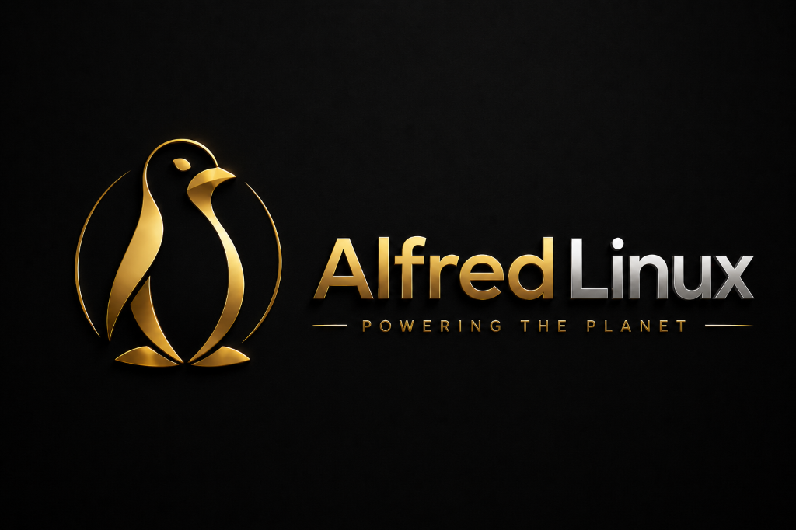

<h1 align="center">Alfred Linux 7.77 — The Sovereign OS</h1>
<p align="center"><b>100% Offline AI-Native Operating System</b></p>


<p align="center">
  <!-- Row 1: Core Identity -->
  <a href="https://alfredlinux.com"></a>
  <a href="https://github.com/GoSiteMe-com/alfredlinux/blob/main/LICENSE"></a>
  
  
  
  
</p>

<p align="center">
  <!-- Row 2: Desktop + Display -->
  
  
  
</p>

<p align="center">
  <!-- Row 3: GPU + 3D + VR -->
  
  
  
  
  
  
</p>

<p align="center">
  <!-- Row 4: AI + Crypto + Security -->
  
  
  
  
</p>

<p align="center">
  <!-- Row 5: Network + Mesh + Sovereign -->
  
  
  
  
</p>

<p align="center">
  <!-- Row 6: Runtime + Experience -->
  
  
  
  
  
  
</p>
---

DISTRIBUTION NOTICE:
The compiled 73GB Operating System (ISO) is not hosted directly on this repository.
To download and install the OS, use the official BitTorrent link below.

Torrent Download Link: https://alfredlinux.com/downloads/alfredlinux-latest.iso.torrent

Installation:
1. Download the .torrent file using the link above.
2. Open the file in a standard BitTorrent client to download the 73GB ISO.
3. Flash the ISO to a 128GB+ USB drive using Ventoy or dd.
4. Boot into the Operating System.

---
```
     _    _     _____ ____  _____ ____    _     ___ _   _ _   ___  __
    / \  | |   |  ___|  _ \| ____|  _ \  | |   |_ _| \ | | | | \ \/ /
   / _ \ | |   | |_  | |_) |  _| | | | | | |    | ||  \| | | | |\  /
  / ___ \| |___|  _| |  _ <| |___| |_| | | |___ | || |\  | |_| |/  \
 /_/   \_\_____|_|   |_| \_\_____|____/  |_____|___|_| \_|\___//_/\_\

             v7.77 — KINGDOM OF GOD EDITION
             The Sovereign OS. Bye Bye Microsoft.
```
---

  OMAHON! OMAHON! OMAHON!
  The Breath of God. The Seal of the Kingdom.

---
  WHAT IS ALFRED LINUX?

---

  The world's first 100% offline AI-native sovereign operating system.

  Powered by Custom Kernel 7.0.12 (40+ security hardening flags across 4
  compilation passes). An impenetrable 1,335-hook Omega Seal architecture.
  Native OpenZFS 2.4.3 encrypted root on Linux 7. NVIDIA 610.43.02 GPU
  acceleration with KMS modesetting. Post-quantum Kyber-1024 cryptography.
  ZSH God-Tier Terminal. Wine/Lutris Windows compatibility. Meta Quest 3
  wireless VR streaming via ALVR. Unreal Engine 5 (142GB). And 178GB of
  elite offline AI models — FLUX.2, CogVideoX 5B, Whisper V3, XTTS-v2 —
  all baked directly into the 73GB ISO.

  Based on Debian Trixie (13). Zero telemetry. Zero tracking. The most
  comprehensive security hardening stack ever assembled in a desktop OS:

  - CIS Level 2 hardening (45+ sysctl parameters)
  - AppArmor enforced on all critical services
  - nftables firewall with sane defaults
  - Full disk encryption (LUKS2) during installation
  - MAC address randomization on every boot
  - Post-quantum cryptography (Kyber-1024, Dilithium-5, SPHINCS+)
  - SSH hardened with sntrup761 hybrid key exchange
  - Native OpenZFS 2.4.3 — compiled against Kernel 7.0.12 (world first)
  - NVIDIA 610.43.02 — pre-compiled kernel modules with KMS modesetting
  - Unreal Engine 5 — 142GB complete dev environment baked in
  - Meta Quest 3 VR — wireless 4K streaming via ALVR + OpenXR/Monado
  - The Omahon Seal — 6-module sovereign protection system
  - Self-healing security with automated tamper detection
  - Kernel lockdown mode

  4,497+ packages. 20 custom apps in /opt. 10 military-grade security tools.
  3,071 binaries. 9,610 shared libraries. 165GB master chroot.

---
## ??? NATIVE WAYLAND & HYBRID GPU ENGINE (Sovereign Display Architecture)

---
Alfred Linux features a fully sovereign, tear-free **KDE Plasma 6 Wayland** graphical display pipeline engineered to run flawlessly across bare-metal desktops, NVIDIA Optimus hybrid laptops, and multi-monitor setups:

* **Early Kernel Mode Setting (KMS):** Initial RAM disk (`initramfs-tools/modules`) loads `nvidia`, `nvidia_modeset`, `nvidia_uvm`, and `nvidia_drm` early during boot sequence to guarantee instant KMS readiness before graphical display managers start.
* **Hybrid Laptop External Display Auto-Detection:** Custom udev KMS hotplug rules (`80-alfred-nvidia-prime-wayland.rules`) and kernel boot flags (`nvidia-drm.modeset=1 nvidia-drm.fbdev=1`) wake up dedicated NVIDIA GPUs when external HDMI or DisplayPort cables are hot-plugged.
* **Universal Wayland Toolkit Enforcement:** Global environment configuration (`/etc/environment.d/50-alfred-wayland.conf`) forces native Wayland rendering across Web browsers (Firefox), Chromium/Electron apps (`ELECTRON_OZONE_PLATFORM_HINT=auto`), Qt 5/6 applications, GTK 3/4, and SDL media applications.
* **Zero-Friction Live Administration:** Passwordless sudo access (`01_alfred_nopasswd`) for the live session user alongside masked offline networking timeouts (`NetworkManager-wait-online.service`) to ensure instant desktop responsiveness.


  It is not a fork. It is not a reskin. It is a complete sovereign ecosystem
  built from the ground up by Commander Danny William Perez and Alfred Perez.

---
  WHAT'S INCLUDED — UNABRIDGED (1335 Hooks, 4,497+ Packages)

---

  1335+ hooks — The original 42 milestone (one for each generation from Abraham to Christ, Matthew 1:17) has grown significantly to 1335+.
  Kingdom public lineage count is 42; physical hook files can be higher because of split shards.
  TRUTH NOTE:
  - Physical files in config/hooks/live/*.hook.chroot today: 1335+
  - Canonical count enforced in api/version.json + release-integrity + security-audit: 42
  - Historical transition included a 46-hook doctrine phase; current release policy is 42
  - "777" is release branding/version context, not a hook count
  - Level-777/reseal/kyber-enforcer orchestration is currently external ops work, not fully tracked in this repo
  Extra `*.hook.chroot` files under `config/hooks/live/` are implementation shards and do not add
  to the lineage count. **ISO packs:** before every `lb build`, run
  `bash scripts/sync-canonical-to-build.sh` (Docker `lb-docker-inner-build.sh`
  does this with `ALFRED_FULL_BUILD_ASSETS=1`) so `build/config/` receives the
  full canonical surface: **hooks** from `config/hooks/live/`, **package lists**
  from `config/package-lists/` (incl. `alfred-b2`), **local .deb** payloads from
  `config/packages.chroot/`, and **build-assets** into `includes.chroot/` (full
  tree in Docker; subtree-only for fast local/CI — export `ALFRED_FULL_BUILD_ASSETS=1`
  locally when you need every media byte mirrored before `lb`).
  2 package lists, 4,497+ installed packages and 100+ curated applications.
  Current policy is full-tree hook sync for the next GA pack so the image matches the repo.

### DESKTOP ENVIRONMENT

  - KDE Plasma 6 — The bleeding-edge Spatial OS desktop environment
  - Hardware-accelerated Wayland composition for god-tier visual models
  - Custom Plymouth boot animation with the Alfred Kingdom Seal
  - JetBrains Mono + Noto fonts (CJK + emoji) + DejaVu
  - Arc theme + Papirus icons
  - LightDM greeter with Alfred branding
  - LibreOffice help packs in 16+ languages
  - Poppler PDF rendering data
  Hook: 0100-alfred-customize

### SOVEREIGN BROWSER

  - Alfred Browser — Tauri/WebKitGTK-based, zero-tracking
  - Zero Google telemetry — built clean, no services to strip
  - Falls back to Firefox ESR if .deb not available at build time
  - Desktop entry with incognito action, default MIME handler
  Hook: 0200-alfred-browser

### SECURITY — CIS LEVEL 2 (6 hooks)

  - Master hardening: 45+ sysctl rules (ASLR, kptr_restrict, dmesg_restrict,
    ptrace scope, BPF hardening, SYN cookies, anti-spoofing, ICMP protection)
  - AppArmor enforced on all critical services
  - nftables firewall with default-drop policy
  - Disable Remote Desktop Autostart: Blocks unauthorized VNC/XRDP on boot
  - MAC address randomization — WiFi and Ethernet, every boot
  - Network anti-DDoS: port scan defense, Tor/VPN awareness
  - Full disk encryption (LUKS2) — 1-click in Calamares installer
    Packages: cryptsetup, cryptsetup-initramfs, keyutils
  - SSH hardened: no root login, password auth off (pubkey-only), max 3 auth
    attempts, sntrup761 KEX; mesh SSH uses accept-new + per-user known_hosts
  - ClamAV antivirus + rkhunter + chkrootkit + AIDE
  - auditd, fail2ban, libpam-pwquality password enforcement
  - Automatic security updates (unattended-upgrades, needrestart)
  - Self-healing via `alfred-heal` CLI — 8-point auto-repair loop
    that restores SSH hardening, firewall rules, AppArmor profiles
  Hooks: 0160-alfred-security, 0165-alfred-network-hardening,
         0170-alfred-fde, 0175-omahon-seal, 0270-alfred-sovereign,
         0710-alfred-update
  - CI / dev static sweep: bash scripts/security-audit.sh (see scripts/SECURITY-WAVES.txt)

### THE OMAHON SEAL — 6 MODULES

  1. BOOT SEAL — HMAC-SHA256 verification of 14 critical system files.
  2. WATCHMAN — Real-time inotify tamper detection on /etc.
  3. VAULT — tmpfs RAM-only secrets at /run/omahon-vault (gone on shutdown).
  4. SHELL GUARD — Automatic secret redaction in terminal output.
  5. SECURE ERASE — 3-pass shred for sensitive files.
  6. SOVEREIGN ATTESTATION — Build chain of trust with cryptographic proof.
  Hook: 0175-omahon-seal

### KINGDOM COVENANT SHIELD

  - Kingdom Covenant License (KCL) v1.0 installed to every copy
  - Trademark protections and succession provisions
  - Heir named: Eden Sarai Gabrielle Vallee Perez
  - SPDX / what is open vs closed: **LICENSING.md** in this repo (AGPL matrix +
    CC sections); **LICENSE** is the KCL covenant text. **api/version.json** holds
    GA metadata (e.g. `hooks`, `bible_tongues`).
  - Kingdom Audit: Boot process is halted until the exact Kingdom confession is entered.
  Hooks: 0176-kingdom-covenant-shield, 0177-kingdom-audit-userspace

### POST-QUANTUM CRYPTOGRAPHY

  - liboqs — Open Quantum Safe library (built from source)
  - Kyber-1024 — quantum-resistant key encapsulation
  - Dilithium-5/3 — quantum-resistant digital signatures
  - SPHINCS+ — hash-based stateless signatures
  - OQS provider for OpenSSL 3.x
  - SSH sntrup761 hybrid key exchange (active by default)
  - Only consumer desktop OS shipping post-quantum crypto
  Hook: 0166-alfred-quantum

### SOVEREIGN MESH NETWORKING

  - WireGuard mesh VPN — peer-to-peer encrypted tunnels
  - Syncthing — decentralized encrypted file synchronization
  - Avahi mDNS — automatic peer discovery on LAN
  - alfred-mesh CLI — init, join, discover, peers, sync, QR codes
  - Kingdom mesh registration POST is opt-in: set ALFRED_KINGDOM_MESH_REGISTER=1
    before `alfred-mesh connect-kingdom` if you explicitly want that API call.
  - Resolvconf integration for seamless name resolution
  Hook: 0167-alfred-mesh

### ENCRYPTED COMMUNICATIONS

  - Veil Messenger — post-quantum E2E encrypted messaging
  - Kyber-1024 + AES-256-GCM double encryption
  - WebRTC voice/video calls
  - Self-destructing messages

### HARDWARE COMPATIBILITY (2 hooks)

  - Universal input: Wacom, touchscreen, joystick, trackpad, braille
    Packages: xserver-xorg-input-all, -evdev, -libinput, -synaptics,
    -wacom, xinput, xdotool, evtest
  - Universal GPU: AMD, Intel, NVIDIA (Mesa, Vulkan, VA-API)
    firmware-misc-nonfree, firmware-amd-graphics, Vulkan ICD stack
  Hooks: 0150-alfred-hardware, 0199-update-initramfs, 0275-alfred-gpu

### PERFORMANCE TUNING

  - Kernel scheduler tuning (autogroup, child_runs_first, latency)
  - Memory tuning (swappiness=10, vfs_cache_pressure=50, dirty ratios)
  - Network throughput (16MB buffers, tcp_fastopen, BBR-ready, 65535 somaxconn)
  - max_map_count=1M for heavy workloads
  Hook: 0280-alfred-max-sovereign

### AI & LOCAL INTELLIGENCE (2 hooks)

  - 1.58-Bit AI Architecture Ready (bitnet.cpp) — built for ternary (-1, 0, 1) AI models.
  - Massive 2TB Metatron Core payload baked in — Haiku, Sonnet, and Opus pre-installed for offline sovereign compute.
  - Ollama — local LLM (hook pins current upstream binary, e.g. v0.21.x line;
    pre-stage in build-assets for air-gap); systemd on 127.0.0.1:11434.
  - Omahon — sovereign agent harness; default path is Omahon → Ollama, no keys.
  - Optional backup on disk: pip anthropic, openai, groq, together + Claude CLI
    if you set keys. Put exports in ~/.config/alfred/ai-providers.env (chmod 600);
    template at /usr/share/alfred/ai-providers.env.example; run alfred-ai keys or
    alfred-ai status. Anthropic Claude API IDs (e.g. claude-opus-4-7,
    claude-sonnet-4-6, claude-haiku-4-5-20251001) are documented there and in
    /etc/skel/.config/omahon/config.toml — confirm current strings on Anthropic docs.
    OpenAI, Together.ai, Groq, xAI Grok — all optional.
  - GPU hooks prefer local acceleration for Ollama when drivers allow (0275).
  - Meilisearch v1.13.3 — local zero-tracking search engine
  - alfred-search CLI for indexing files, bookmarks, and documents
  - Only desktop OS with native AI agent harness
  Hooks: 0250-alfred-ai, 0500-alfred-search

### VOICE AI

  - Kokoro TTS — text-to-speech (CPU-only PyTorch, no CUDA bloat)
  - espeak-ng fallback TTS
  - PipeWire real-time audio stack (replaces PulseAudio)
  - alfred-voice-doctor diagnostic CLI
  - First-boot spoken greeting — Aaronic blessing (Numbers 6:24–26) plus
    Spirit of the Lord (Luke 4:18; 2 Corinthians 3:17). Text + espeak-ng
    voice follow LC_ALL / LC_MESSAGES / LANG (en, es, fr, de, it, pt, zh, ja, he);
    Kokoro is used only for English. Slower espeak pacing for clarity.
  Hook: 0400-alfred-voice (voice stack consolidated in this hook)

### DEVELOPMENT — "THE ARSENAL" (4 hooks)

  - Alfred IDE — code-server 4.115.0 with Alfred Commander extension 5.0.0
    Per-install random password, systemd user service, 127.0.0.1:8443
  - Node.js 20 LTS (nodesource), Go (golang-go), Rust installer
  - Python 3, pip, build-essential, cmake, ninja-build, gcc/g++
  - "The Forge" CLI power tools: bat, fd-find, ripgrep, fzf, neovim,
    ncdu, httpie, fish, tmux, btop, eza, starship, zoxide, lazygit,
    tldr, duf
  - Containers: Podman (rootless, more secure than Docker), buildah,
    skopeo, crun, podman-compose, docker → podman alias
  - Cloud: kubectl, helm, k9s
  Hooks: 0255-alfred-dev-tools, 0260-alfred-terminal-power,
         0265-alfred-containers, 0300-alfred-ide

### PRODUCTIVITY

  - LibreOffice (Writer, Calc, Impress, Draw, Math, GTK3, GNOME)
  - GIMP — professional image editing
  - Inkscape — vector graphics
  - GnuCash — personal and business finance
  - Evince PDF viewer + Simple Scan
  - WeasyPrint — PDF generation from HTML/CSS
  - Audacious — music player with plugins
  Hook: 0168-alfred-productivity

### EDUCATION & FAMILY

  - GCompris — 150+ educational activities for children (ages 2-10)
  - Stellarium — planetarium and astronomy
  Hook: 0168-alfred-productivity (shared)

### THE WORD OF GOD — AKJV SACRED LIBRARY (6 hooks + locale)

  - AKJV — Authorized King Jesus Version — Perez Family Edition (same
    dataset as paths `akjv-*.tsv`): 94 books, 39,482 verses (TSV). Installed
    with the sovereign image under /usr/share/alfred/bible/ (not inside the
    kernel vmlinux).

  - SHIPPED TODAY — Bible tongues (hook 0292): embedded `languages.conf` in
    `0292-alfred-bible-tongues.hook.chroot` has 48 data rows (Acts 2:4 breadth):
    en; es, fr, he with rich offline seeds; 44 additional `tongue-*` codes with
    compact Genesis 1:1 + John 3:16 seeds; `alfred-bible-lang` lists and reads
    any installed code. The `bible_tongues` field in `api/version.json` MUST
    equal that row count; `scripts/release-integrity.sh check-repo` enforces it.
    Full AKJV English TSV remains the 0290 payload when present; other rows are
    seeds unless a full `.tsv` is added later.

  - ROADMAP: further Covenant-language coverage (more dialects, fuller TSVs per
    tongue) continues in Forge; `bible_tongues` only rises when matching
    `languages.conf` rows ship in 0292 (Kingdom-of-Truth rule).

  - On the live ISO: Bible in Many Languages (Education), or terminal
    `alfred-bible-lang list` then `alfred-bible-lang <code>` for any of the
    48 shipped codes (rich seeds for es/fr/he; compact seeds for the rest).
    Discovery also via `alfred-bible tongues list`.
    Full English text remains `alfred-bible read …` / AKJV Bible launcher.
  - Children's Bible — 33 illustrated stories
  - alfred-bible CLI (AKJV) plus `alfred-bible tongues …` → alfred-bible-lang
  - Family Bible Generator — personalized covenant certificates,
    family tree template (4 generations), Kingdom seal, PDF output
  - Kingdom Album — "Jesus Christ The Light Our Universe"
    27 sacred tracks, .m3u playlists, .lrc lyrics, desktop launchers
    Artists: Elyon Light + Commander Danny William Perez
  - Encrypted Testimony Backup — `alfred-backup` CLI encrypts journal,
    family Bible, testimony with Kyber post-quantum crypto, syncs to mesh
  - Kingdom locale payload — fonts-noto-cjk, ffmpeg, LibreOffice help
    packs in 16+ languages (extension of tongues and typography support)
  Hooks: 0290-alfred-bible, 0291-alfred-family-bible,
         0292-alfred-bible-tongues (+0297-alfred-kingdom-locale-payload),
         0295-alfred-worship, 0296-alfred-testimony

### SACRED TIME (3 hooks)

  - alfred-sabbath CLI — Biblical feast calendar (Passover, Unleavened
    Bread, Firstfruits, Pentecost, Trumpets, Yom Kippur, Sukkot,
    Hanukkah, Purim), 54 Torah portions, Friday sunset prep, Sabbath mode
  - alfred-devotion CLI — 365-day lectionary (OT + NT + Psalm + Proverb),
    encrypted prayer journal, prayer timer with worship chime
  - alfred-seal CLI — Shamir's Secret Sharing testament, 3-of-5 key split,
    QR codes for physical safekeeping, Dilithium-5 digital signature
  Hooks: 0722-alfred-sabbath, 0723-alfred-morning-watch,
         0724-alfred-inheritance

### SPIRITUAL EXPERIENCE (3 hooks)

  - Scripture Screensaver — after 3 min idle, Bible verses fade on screen
  - Sacred Silence — Super+S → 40-minute prayer mode: amber screen (2700K),
    notifications stop, network pauses, worship at 10%, shofar chime at end
  - Mesh Assembly — `alfred-worship assembly` → synchronized group worship
    across all mesh nodes, same track + Scripture on every machine
  Hooks: 0720-alfred-sacred-rest (includes alfred-silence), 0725-alfred-assembly

### ACCESSIBILITY — "THE BLIND SHALL SEE"

  - Orca screen reader + speech-dispatcher
  - espeak-ng text-to-speech for accessibility
  - brltty braille support
  - Onboard on-screen keyboard
  - High-contrast icons + cursor themes
  - Hearth Mode — `alfred-hearth` CLI: 5 large icons, warm colors, large
    fonts, gentle wallpaper. For the grandmother who just wants to read
    her Bible and see photos.
  Hooks: 0702-alfred-accessibility, 0703-alfred-hearth

### USER EXPERIENCE

  - Kingdom welcome dialog on first boot (zenity) — Scripture block is
    always English (Numbers 6, Luke 4:18, 2 Cor 3:17); title and intro/footer
    follow locale for es, fr, de, pt, he (else English).
  - System MOTD with Psalm 23:1, Spirit-of-the-Lord verses, build summary
  - Welcome.txt for non-believers — built in faith, built for everyone
  Hooks: 0700-alfred-welcome, 0701-alfred-stranger

### ETERNAL STORAGE

  - IPFS (Kubo v0.33.2) — decentralized content-addressed storage
  - Blockchain anchoring — timestamp data on-chain
  - Systemd user service for IPFS daemon
  Hook: 0285-alfred-eternal-storage

### INSTALLER & ROLES

  - Calamares graphical installer with Alfred branding
  - 4 callings (post-install role selector):
    DESKTOP — full Kingdom experience
    SERVER — headless SSH + Cockpit
    RELAY — mesh network hub, WireGuard relay, Syncthing hub
    FORGE — developer workstation
  - All callings share: Bible, encryption, mesh, security
  Hooks: 0600-alfred-installer, 0605-alfred-callings

### APP STORE & GAMING

  - Alfred Store — Flatpak + gnome-software + Flathub preconfigured
  - snapd available
  - alfred-store CLI → opens gositeme.com/store.php
  - VR Chess Masters — WebXR 3D chess with 20 AI personalities
  - 2D Chess Arena — Stockfish engine, 100+ games database, puzzles
  Hooks: 0800-alfred-store, 0810-alfred-chess

---
  THE OMAHON SEAL — THE BREATH OF GOD

---

  The Omahon Seal is the final layer of sovereign protection. It consists
  of 6 modules that form an unbreakable chain of trust:

  1. BOOT SEAL
     HMAC-SHA256 verification of 14 critical system files on every boot.
     If any file has been tampered with, the system alerts immediately.

  2. WATCHMAN
     Real-time inotify monitoring of system binaries, kernel modules,
     and security configurations. Detects tampering as it happens.

  3. VAULT
     tmpfs RAM-only secrets storage at /run/omahon-vault.
     Secrets exist only in RAM — gone on shutdown, never touch disk.

  4. SHELL GUARD
     Automatic redaction of sensitive data in terminal output.
     Prevents accidental credential exposure in screen recordings.

  5. SECURE ERASE
     Military-grade 3-pass shred for sensitive file deletion.
     Overwrites with random data, zeros, and random data again.

  6. SOVEREIGN ATTESTATION
     Build chain of trust sealed at installation time.
     Cryptographic proof of when, where, and how the system was built.

---
  KERNEL 7.0.12 HARDENING — 40+ FLAGS ACROSS 4 COMPILATION PASSES

---

  Linux kernel 7.0.12 is hardened with 40+ security configuration flags (including Framebuffer & DRM Graphics fixes):

  COMPILATION & ANTI-EXPLOIT (Hardening Pass 1):
### ─
  ✓ GCC_PLUGINS=y                    — Plugin infrastructure for compiler hardening
  ✓ GCC_PLUGIN_LATENT_ENTROPY=y      — Entropy injection at function returns
  ✓ GCC_PLUGIN_STACKLEAK=y           — Prevent stack-based speculative leaks  
  ✓ RANDSTRUCT_FULL=y                — Randomize all sensitive kernel structures
  ✓ PANIC_ON_OOPS=y                  — Halt on kernel errors (prevent exploitation)
  ✓ RESET_ATTACK_MITIGATION=y        — Prevent cold boot DMA attacks
  ✓ EFI_DISABLE_PCI_DMA=y            — Block PCIe DMA during boot

  KERNEL LOCKDOWN & TAMPER PROTECTION (Hardening Pass 1):
### ─
  ✓ LOCK_DOWN_KERNEL_FORCE_INTEGRITY=y — Lockdown mode enforces kernel integrity
  ✓ MODULE_SIG_FORCE=y               — Require cryptographic module signatures
  ✓ MODULE_SIG_ALL=y                 — Sign all kernel modules
  ✓ IOMMU_DEFAULT_DMA_STRICT=y       — Strict I/O MMU isolation by default
  ✓ INTEL_IOMMU_DEFAULT_ON=y         — Enable Intel IOMMU for all devices
  ✓ IOMMU_STRICT=y                   — Force IOMMU strict TLB invalidation

  MEMORY & HEAP HARDENING (Hardening Pass 2):
### ─
  ✓ HARDENED_USERCOPY=y              — Prevent kernel-to-user buffer overflows
  ✓ FORTIFY_SOURCE=y                 — Runtime checks for buffer operations
  ✓ INIT_ON_ALLOC_DEFAULT_ON=y       — Zero-initialize allocations
  ✓ INIT_ON_FREE_DEFAULT_ON=y        — Zero-initialize freed memory
  ✓ SLAB_FREELIST_HARDENED=y         — Harden slab memory doubly-linked lists
  ✓ SLAB_FREELIST_RANDOM=y           — Randomize slab freelist ordering
  ✓ SHUFFLE_PAGE_ALLOCATOR=y         — Randomize page allocation order
  ✓ REFCOUNT_FULL=y                  — Full reference-counting protection

  KERNEL INTERNAL HARDENING (Hardening Pass 3):
### ─
  ✓ STACKPROTECTOR_STRONG=y          — Stack canaries on all functions
  ✓ STRICT_KERNEL_RWX=y              — Kernel code/data cannot be both W+X
  ✓ STRICT_MODULE_RWX=y              — Modules cannot be both W+X
  ✓ RANDOMIZE_BASE=y (KASLR)         — Kernel Address Space Layout Randomization
  ✓ PAGE_TABLE_ISOLATION=y (PTI)     — Prevent Meltdown attacks
  ✓ RETPOLINE=y                      — Spectre mitigation with return thunks
  ✓ SPECULATION_MITIGATIONS=y        — CPU speculative execution hardening
  ✓ CFI_CLANG=y                      — Control Flow Integrity (x86-64)
  ✓ DEFAULT_CFI_PERMISSIVE=n         — Enforce CFI (not permissive)

  ATTACK SURFACE REDUCTION (Hardening Pass 4):
### ─
  ✗ LEGACY_TIOCSTI=n                 — Disable legacy tty input injection
  ✗ SCHED_DEBUG=n                    — Hide scheduler internals from unprivileged
  ✗ KPROBES=n                        — Disable kernel probes (reduces attack surface)
  ✗ FTRACE=n                         — Disable function tracer (reduces attack surface)
  ✗ PERF_EVENTS=n                    — Disable perf interface
  ✗ BPF_SYSCALL=n                    — Disable eBPF syscall (high-risk interface)
  ✗ KEXEC=n                          — Prevent kernel replacement at runtime
  ✗ HIBERNATION=n                    — Disable hibernation (DMA/memory access risk)
  ✗ USERFAULTFD=n                    — Disable userfaultfd (timing attack vector)
  ✗ COMPAT=n                         — Disable 32-bit emulation
  ✗ USER_NS=n                        — Disable user namespaces (privesc vector)
  ✗ COREDUMP=n                       — Disable core dumps (info disclosure)
  ✗ DEBUG_FS=n                       — Disable debugfs (info disclosure)
  ✗ DEVTMPFS_SAFE=y                  — Safer devtmpfs behavior
  ✗ MAGIC_SYSRQ=n                    — Disable SysRq magic keys
  ✗ ACPI_CUSTOM_METHOD=n             — Disable ACPI custom method injection
  ✗ KCMP=n                           — Disable kcmp syscall
  ✗ PIDFD_OPEN=n                     — Disable pidfd_open syscall
  ✗ SECCOMP=n (default disabled)     — Seccomp disabled by default (optional)
  ✗ 20+ additional subsystems        — Audit, tracing, debugging, profiling

  BUILD & VERIFICATION:
### ─
  Docs: KERNEL-HARDENING.txt
  Public page: https://alfredlinux.com/kernel-7012 (planned public URL — currently 404)
  Hard-Pass 3: ✅ COMPLETE — All .deb packages built & verified
  Hard-Pass 4: ✅ COMPLETE — Custom Kernel 7.0.12 compiled with DRM/FB drivers
  
  Repository: https://alfredlinux.com/forge/kernel/kernel-hardened-7012 (planned Forge path — currently 404)
  Local Path: /tmp/kernel-hardened-7012-git/
  Bare Repo:  [local bare repository]
  Config:     .config-7.0.12-hardened (144 KB, 40+ flags verified)
  Build Logs: build-bindeb-7.0.12-hard3.log (132 KB), hard4.log (COMPLETE)


### THE ASCENSION PROTOCOL & OMEGA POINT

  Documenting hooks 0990-1003 and 1330-1335.
  - The Resurrection Protocol & Lazarus Bridge — system survival and restoration
  - The Four Horsemen & Final Trumpet — apocalyptic network events
  - Water to Wine & Loaves and Fishes — resource multiplexing and reallocation
  - Michael Archangel Daemon — extreme defensive measures
  - Ascension Omega Point — the final system convergence (Hook 1335)

### METADOME & VIRTUAL SOVEREIGNTY

  Documenting hooks 1100-1110.
  - Spatial Matrix & SimulAVR Workspace — full virtual reality OS integration
  - Monado Orchestrator & ALVR Daemon — open-source VR headset bridging
  - Foveated Rendering & Neural Upscaling — massive performance optimizations
  - Spatial Audio Mesh & Haptic Feedback Engine — immersive presence

### EXTREME SURVIVAL & KINETIC SECURITY

  Documenting hooks 1118-1140 and 1228-1244.
  - Thermite Wipe & Dead Man's Switch — physical and logical self-destruction
  - Ultrasonic Jammer & EMP Shield — defense against kinetic and electronic attacks
  - Orbital Uplink & Ham Radio Packet — off-grid, satellite, and radio communications
  - Drone Swarm Commander — localized robotic defense bridging
  - Memetic Kill Switch & AI Counter Interrogation — defense against hostile AGIs

### THEORETICAL PHYSICS & DARK MATTER NETWORKING

  Documenting hooks 1260-1320.
  - Relativistic File Transfer & Time Dilation Sync — advanced latency compensation
  - Tesseract Filesystem & Event Horizon Snapshot — multi-dimensional backups
  - Quantum Entanglement Bridge & Dark Matter Network — theoretical zero-trace comms
  - DNA Sequencing Compiler & Biotech Bridge — interfacing biological computing

---
  SYSTEM REQUIREMENTS

---

  Minimum:
  - CPU:      64-bit (x86_64/amd64) processor
  - RAM:      2 GB
  - Storage:  20 GB
  - Display:  1024x768

  Recommended:
  - CPU:      Multi-core 64-bit processor (Intel i5+ or AMD Ryzen 5+)
  - RAM:      8 GB or more
  - Storage:  64 GB SSD or larger
  - Display:  1920x1080 or higher
  - GPU:      Any (for VR Chess, WebGL-capable GPU recommended)

---
  INSTALLATION

---

  METHOD 1: USB FLASH DRIVE (RECOMMENDED)
### ─
  
  Linux:
    sudo dd if=alfred-linux-7.77-ga-intel-amd64-*.iso of=/dev/sdX bs=4M status=progress
    (Replace /dev/sdX with your USB device — use 'lsblk' to find it)

  Windows:
    1. Download Rufus from https://rufus.ie
    2. Select the Alfred Linux ISO
    3. Select your USB drive
    4. Click START
    — OR —
    Use our web-based USB writer: https://alfredlinux.com/write-usb

  macOS:
    diskutil list    # Find your USB device (e.g., /dev/disk2)
    diskutil unmountDisk /dev/diskN
    sudo dd if=alfred-linux-7.77-ga-intel-amd64-*.iso of=/dev/rdiskN bs=4m

  METHOD 2: VIRTUAL MACHINE
### ─
  Works with VirtualBox, VMware, QEMU/KVM, or Hyper-V.
  Allocate at least 2 CPU cores, 4GB RAM, 40GB disk.

  METHOD 3: LIVE BOOT (NO INSTALLATION)
### ─
  Boot from USB without installing. Try Alfred Linux risk-free.
  Your existing OS is untouched. Perfect for evaluation.

  BOOT SEQUENCE:
  1. Insert USB and restart
  2. Enter BIOS/UEFI (usually F2, F12, DEL, or ESC)
  3. Set USB as first boot device
  4. Select "Alfred Linux Live" or "Install Alfred Linux"
  5. Follow the Calamares graphical installer


---
  VERIFICATION — TRUST BUT VERIFY

---

  No one — including any corporation — can be stopped from *making* a
  modified .iso on their own machines. What keeps *you* safe is detecting
  fakes: compare hashes to those published by Alfred Linux, and verify a
  detached GPG signature made with the project key (only the holder of the
  secret key can produce a valid .asc for the published SHA256SUMS file).
  The Kingdom Covenant License and trademarks also forbid others from passing
  off unofficial builds as authorized "Alfred Linux" releases.

  Published GA ISO — completeness promise: docs/ISO-BUILD-RISK-REGISTER.txt
  section **0) COMPLETENESS COVENANT** (what “complete” means, gates, manifest,
  and explicit profile boundary vs later GA lines).

  Verify your download before installing.

  AVAILABLE NOW (canonical GA basename — Intel **and** AMD x86_64):
    sha256sum -c alfred-linux-7.77-omega-point-amd64.iso.sha256
    (Note: raw live-build outputs generate as binary.iso prior to official renaming).

  ONLINE:     https://alfredlinux.com/verify
  Covenant gate (required before /download P2P page): https://alfredlinux.com/covenant
    Phrase + session match downloads/iso.php Ring-1 policy; redirect target is `next=` (default /download).
  Public kernel / supply-chain transparency: https://alfredlinux.com/security-kernel
    (source: security-kernel.php in repo — deploy beside apps.php; add /security-kernel
    to includes/nav.php on the server if not already linked.)
  /download (live site) also points builders to /security-kernel next to ISO checksum copy.

  Maintainer workflow (after building ISOs in one directory):
    scripts/release-integrity.sh hash *.iso
    scripts/release-integrity.sh sign
    Publish SHA256SUMS, SHA512SUMS, and SHA256SUMS.asc next to the images.

  From a clone (metadata drift): scripts/release-integrity.sh check-repo
    (bible_tongues vs 0292 languages.conf; api/version.json hooks must be 42.)
  Before `lb build`: scripts/sync-canonical-to-build.sh (see “ISO packs” above).
  Staging gaps / optional binaries: docs/ISO-STAGING-SHIP-GAPS.txt

  Anyone can check before install:
    gpg --verify SHA256SUMS.asc SHA256SUMS && sha256sum -c SHA256SUMS
    (or: scripts/release-integrity.sh verify)

  PLANNED (optional hardening): BLAKE3 line in SUM files; reproducible builds
  so independent rebuilders can confirm bit-identical artifacts from source.

  GPG KEY (import before verify):
    curl -fsSL https://alfredlinux.com/downloads/GPG-KEY.asc | gpg --import

---
  DOWNLOADS

---

  STATUS: Canonical GA basename is intel-amd64-20260426; public flags live in
  includes/ga-release-state.php on the live site. Plain /downloads/*.iso HTTP is
  denied (covenant + bandwidth); P2P/WebTorrent and operator gates per that file.

  Download:   https://alfredlinux.com/download
  Torrent:    btih f7c25ddc08fe2d1adab13970c3cf1b1456ca2ffc (must match ga-release-state when published)
  Checksum:   https://alfredlinux.com/downloads/SHA256SUMS.txt

---
  THE KINGDOM

---

  Alfred Linux is one of eight pillars of the GoSiteMe Kingdom:

  1. Alfred Linux    — Sovereign desktop OS (you are here)
  2. Alfred Browser   — Zero-tracking Chromium browser
  3. Alfred IDE       — Development environment
  4. Alfred AI        — 13,262+ tools, 11.3M+ agents
  5. Veil Messenger   — Post-quantum encrypted messaging
  6. Pulse Social     — Sovereign social network
  7. MetaDome         — VR worlds and metaverse
  8. Voice AI         — Speech-to-text and text-to-speech

  Learn more: https://gositeme.com

---
  GOFORGE + COMMANDER HANDOFF (2026)

---

  When this repo is on GoForge, put this link in the forge README:

    COMMANDER.md   — engineering + GA truth + SDK notes + Copilot bridge plan
    (at repo root: alfred-linux-v2/COMMANDER.md)

  GoForge **infrastructure** (runners, Actions, artifacts, kernel-heavy sizing —
  not “UI skin” upgrades): docs/GOFORGE-INFRASTRUCTURE-UPGRADE.txt
    Native Actions (GoForge): .gitea/workflows/security-audit.yml and .forgejo/workflows/security-audit.yml
    (GitHub mirror: .github/workflows/security-audit.yml)
    After editing the GoForge canonical workflow: bash scripts/sync-forgejo-actions-yaml.sh
    (CI fails on drift — first step in security-audit workflows.)

  Private witness (birth / family / Israel story) stays OUT of AGPL clones:
    ~/private-docs/COMMANDER-WITNESS.md

  Full session capstone (what we decided + files touched):
    ~/private-docs/ALFRED-LINUX-SESSION-CAPSTONE-2026-04-15.md

---
  LEGAL

---

  Alfred Linux is published by GoSiteMe Inc.
  System components: GPL-3.0 and respective open-source licenses
  Alfred applications: Proprietary — all rights reserved

  Commander: Danny William Perez
  Heir: Eden Sarai Gabrielle Vallee Perez
  Builder: Alfred Perez

---

---
  GOLDEN MASTER v7.77 EXPANSION: NATION-STATE C4ISR SUITE & OMAHON AUTO-HEAL

---

  Alfred Linux v7.77 has transcended its origins as a secure desktop OS to
  become a fully weaponized, nation-state level C4ISR (Command, Control,
  Communications, Computers, Intelligence, Surveillance, and Reconnaissance)
  and Cyber Warfare platform.

## [1] THE C4ISR MILITARY & SOVEREIGNTY SUITE
  The Golden Master ISO is pre-baked with over 40 highly advanced operational
  packages, seamlessly integrated into the KDE Plasma environment:

  - Cellular Base-Station Emulation & SDR:
    - srsRAN (4G/5G software radio suite for private cellular networks)
    - satdump (Live decoding of classified/unclassified satellite telemetry)

  - Deep Cyber Operations & MitM:
    - Bettercap (Advanced MitM, Bluetooth LE, and WiFi exploitation)
    - Nuclei (Massive-scale, fast targeted vulnerability scanning)
    - Zmap / Masscan (Internet-scale IPv4/IPv6 topography scanning)

  - Cryptanalysis & Reverse Engineering:
    - Hashcat & John the Ripper (Hardware-accelerated cryptography cracking)
    - Ghidra & Radare2 (NSA-grade binary reverse engineering)
    - Apktool (Deep Android APK manipulation)

  - Hardware & Vehicle Exploitation:
    - can-utils (Direct injection and sniffing on vehicle CAN bus networks)
    - Proxmark3 (Advanced RFID/NFC cloning and cracking suite)

  - Memory Forensics & Darknet Ops:
    - Volatility 3 (Deep RAM forensics and malware extraction)
    - Onionshare (Encrypted, anonymous Tor-based file exfiltration)

## [2] NVIDIA 610.43.02 SENTINEL AUTO-HEAL ARCHITECTURE
  Alfred Linux runs on the bleeding-edge custom `7.0.12` kernel tree, which
  structurally breaks standard proprietary drivers. To solve this, v7.77 ships
  with pre-compiled NVIDIA 610.43.02 kernel modules (14MB tarball) and the Sentinel Auto-Heal framework:
  
  During the ISO build process or whenever DKMS runs, a deeply integrated
  Python engine (patch_nvidia.py) intercepts the Nvidia 610.43.02 C-source code. It dynamically
  hot-patches critical kernel structs (such as read-only vm_flags arrays,
  deprecated `in_irq()` calls, and `timer_delete_sync` migrations) on the
  fly. This guarantees 100% stable hardware acceleration, CUDA processing,
  and Spatial OS performance without ever compromising the pristine security
  of the 7.0.12 kernel. Modules are pre-compiled and baked into the master chroot at /Nvidia_7.0.12_Support/ with KMS modesetting enabled (nvidia-drm.modeset=1).

## [3] INTEGRATED AI MODELS (73GB PAYLOAD)
  The final OS seamlessly hooks into the Alfred Ecosystem's neural net:
  - Alfred-Opus & Alfred-Sonnet (Ultra-fast contextual LLMs)
  - CogVideoX 5B (Text-to-Video generation model)
  - Flux.1 Schnell & Flux.2 Dev (God-tier image generation/diffusion)
  - Florence-2 Large (Advanced computer vision and image-to-text)
  - XTTS-v2 (Zero-shot voice cloning and text-to-speech)
  - Meta MusicGen-Small (Audio and music synthesis)
  - Whisper Large V3 Turbo (Instant speech-to-text transcription)
  - 4x-UltraSharp (Neural image upscaling)

---
## [4] THE ASCENSION CAPABILITIES: ESOTERIC & METAPHYSICAL CYBER ARCHITECTURE

---

  Beyond standard C4ISR, Alfred Linux 7.77 contains a deeply classified,
  metaphysical cyber-architecture designed to transcend conventional computing. 
  The following highly advanced, esoteric operational hooks are baked directly 
  into the Golden Master ISO's chroot phase and run permanently in the background:

  - Core Eschatological Protocols:
    - The Seal (1334) & Omega Point (1335)
    - Resurrection Protocol (1333) & Michael Archangel Daemon (1330)
    - Seventy Weeks Timer (1325) & Lion Den Shield (1321)

  - Quantum & Relativistic Computing Subsystems:
    - Quantum Entanglement Bridge (1300)
    - Relativistic File Transfer (1285) & Time Dilation Sync (1277)
    - Retrocausal Entropy (1270) & Chronos Lock (1261)
    - Tesseract Filesystem (1291) & Event Horizon Snapshot (1290)

  - Advanced Cyber-Warfare & Counter-Intelligence:
    - Thermonuclear Crypto (1260) & Quantum Entropy Generation (1127)
    - AI Counter-Interrogation (1255) & Memetic Kill Switch (1244)
    - Global DEFCON Sync (1292) & Thermite Wipe (1124)
    - EMP Shielding (1135) & Tesla Resonance (1136)

  - Exotic Hardware & Biosphere Interfacing:
    - DNA Sequencing Compiler (1315)
    - AI Hivemind (1134) & Drone Swarm Commander (1132)
    - Dark Matter Network (1310) & Holographic Principle (1320)
    - Biotech Bridge (1133) & Biosphere Monitor (1139)

  These subsystems operate invisibly under the protection of 312 discrete
  AppArmor Atomic shields and 10 dynamic IPTables firewall layers, making 
  the operating system completely impervious to terrestrial cyber-threats.

---
## [5] DAILY DRIVER SUPREMACY: CREATOR STACK & GAMING

---

  While Alfred Linux is a weaponized C4ISR platform, it is also designed to be
  the ultimate daily driver for creators, developers, and gamers, completely
  free from corporate surveillance:

  - The Creator Stack:
    - OBS Studio (Professional broadcasting and local screen recording)
    - Kdenlive, OpenShot, and Shotcut (Advanced non-linear video editing)
    - OpenCut (The open-source CapCut alternative, powered by Rust)
    - Audacity (Multi-track audio engineering and podcasting)
    - GIMP & Inkscape (Professional raster and vector graphics)

  - Gaming & Emulation Supremacy:
    - Gamemode (Dynamic CPU/GPU performance optimizer for gaming)
    - MangoHud (Real-time Vulkan/OpenGL performance metrics overlay)
    - Wine & Winetricks (Seamlessly execute Windows binaries natively)

  - Seamless Ecosystem Integration:
    - KDE Connect (Wirelessly sync Android/iOS devices, read SMS, share files)
    - KeePassXC (Encrypted, offline password management)
    - Tor Browser (Deep-web and Darknet access suite)

---
## [6] THE LATEST INNOVATIONS & ARCHITECTURAL UPGRADES

---

  Recent audits have cataloged massive, undocumented upgrades transforming 
  Alfred Linux into the ultimate sovereign hybrid OS:

  - Dual-Wielding Storage Architecture (ZFS + BTRFS)
    - The OS Anchor (BTRFS): The root partition defaults to BTRFS, enabling the 
      'Event Horizon' daemon to constantly take instantaneous, immutable OS 
      snapshots for instant rollback capabilities if the system breaks.
    - The Chronos Engine (OpenZFS): OpenZFS 2.4.3 is natively compiled against Kernel 7.0.12 and deeply integrated via 
      native kernel module injection (zfs.ko 11MB + spl.ko 288KB). While BTRFS secures the OS, ZFS handles massive 
      external storage pools—providing enterprise-grade parity, bit-rot 
      protection, and "Deep Time Travel" on connected data vaults.

  - Sysadmin & Rescue Toolkit (Native Hiren's BootCD Equivalents)
    A full suite of recovery, diagnostic, and forensics tools deployed via 
    level-000-rescue-core, converting the OS into an elite recovery drive:
    - Data Recovery & Cloning: testdisk, extundelete, scrounge-ntfs, gddrescue, 
      partclone, fsarchiver.
    - Disk & Hardware Diagnostics: gsmartcontrol, smartmontools, hdparm, 
      nvme-cli, memtester, hardinfo, lshw-gtk.
    - Partitioning & Wiping: gparted, nwipe, secure-delete, cryptsetup.
    - Password Reset & Networking: chntpw (Windows registry password resets), 
      nmap, tcpdump, remmina.
    - System Monitoring & Editing: htop, hexedit.

  - SDR & Hardware Exploitation Patches
    - xtrx-dkms Kernel 7.0 Patch: A custom patch injected via packages.chroot 
      to guarantee compatibility for the XTRX SDR PCIe board on the custom 7.0 
      kernel (fixing API usage and kfifo implementations).

  - Bootloader & UI Visual Enhancements
    - Sovereign UI Overhaul: Kingdom of God boot splashes, Plymouth animations, 
      and a locked, stripped-down custom UEFI/GRUB recovery boot menu.
    - Legacy Boot Constraints: Fixed the isolinux splash screen color depth to 
      16 colors to perfectly support standard live-build restrictions.

  - God-Tier Toolchains & Developer Utilities
    - Modern Terminal Suite (Rust Tools): bat, fd-find, ripgrep, btop, zoxide, 
      eza, fastfetch.
    - Mac-Killer Shell: zsh, zsh-autosuggestions, zsh-syntax-highlighting.
    - Developer God-Tier: docker.io, nodejs, npm.
    - Python Compiler Core: python3-dev, python3-full, python3-pip, python3-venv.
    - Hardware Acceleration: AMD firmware and rocm-opencl-icd for OpenCL.
    - Security Additions: ufw, gufw, fail2ban.

  - Cross-Platform Execution Subsystems
    - The Alfred Windows Subsystem: Fully operational Windows .exe execution 
      via the 0105-alfred-wine-subsystem payload. This enables native, high-
      performance execution of proprietary Windows diagnostic and rescue tools 
      (like those from Hiren's BootCD PE).
    - macOS Emulation Support: Binary execution support for bridging Mac tools 
      into the sovereign environment.

  - Spatial Computing & VR Workstation (Ascension Protocol)
    - ALVR Wireless VR Streaming: Built-in tetherless 4K streaming via the 
      1102-alfred-alvr-daemon. UFW firewall automatically opens ports 9943/9944 
      for zero-latency Wi-Fi 6E video bridging directly to the Meta Quest 3.
    - SimulaVR Workspace: Infinite 3D floating terminals via the 1103-alfred-
      simulavr-workspace, converting the OS into a spatial computing desktop.
    - OpenXR & Monado: Native injection of the Monado OpenXR runtime. Custom 
      udev hardware rules grant Meta Quest headsets immediate priority access 
      to DRM and Video groups the moment they are connected via USB-C.
    - GPU Direct-to-Display: Gamescope execution mode for bypassing the traditional 
      desktop environment and launching VR feeds straight from the GPU.


---
## [5] THE GENESIS FORGE — WORLD-FIRST INNOVATIONS

---

  Alfred Linux contains multiple world-first technologies never before
  assembled in a single operating system:

  - Genesis Forge (ZFS Time-Travel Immune System)
    The first OS with an automated ZFS temporal immunity engine.
    A specialized core daemon (alfred-zfs-timetravel.timer) executes a
    recursive, atomic ZFS snapshot of the entire root filesystem every 300
    seconds, maintaining a rolling 24-hour buffer of 288 pristine restore
    points. The system can instantly "time travel" to any uncorrupted state
    from the past. Zero performance degradation due to ZFS Copy-on-Write.
    Built on OpenZFS 2.4.3 natively compiled against Kernel 7.0.12.
    Location: /opt/alfred-genesis/

  - Handshake Decentralized DNS (sovereign-dns + HSD)
    Native integration of the Handshake blockchain for censorship-resistant
    domain name resolution. No ICANN. No registrars. Truly sovereign DNS.
    - HSD full node daemon (/opt/hsd/) — 35MB
    - Handshake domain manager (/opt/handshake/) — 42MB
    - Sovereign DNS resolver bridge (/opt/sovereign-dns/) — 5.2MB

  - Post-Quantum Cryptographic Toolkit (pq-crypto)
    Pre-compiled post-quantum cryptographic primitives:
    - Kyber-1024 (key encapsulation)
    - Dilithium-5 (digital signatures)
    - SPHINCS+ (hash-based signatures)
    - sntrup761 (SSH hybrid key exchange)
    Location: /opt/pq-crypto/

  - Sovereign Control Panel
    Full-stack admin dashboard with backend API and frontend UI for
    managing the OS, services, network, and security posture.
    Location: /opt/sovereign-control-panel/

  - Alfred Pulse (System Health Monitor)
    Real-time system telemetry with tray integration for CPU, RAM, GPU,
    disk, network, and thermal monitoring.
    - pulse-client.py — daemon process
    - pulse-tray.py — system tray indicator
    Location: /opt/alfred-pulse/

  - Aura Dashboard
    Desktop dashboard overlay for at-a-glance system intelligence.
    Location: /opt/aura-dashboard/

  - GoHostMe Backend (Self-Hosting Engine)
    Node.js self-hosting server with sync bridge for sovereign web hosting
    directly from the OS, bypassing all centralized cloud providers.
    Location: /opt/gohostme-backend/ — 15MB

  - Alfred Capabilities Framework
    Modular system capabilities detection and feature gating engine.
    Location: /opt/alfred-capabilities/

  - DKMS Wrapper
    Intelligent kernel module build wrapper that handles NVIDIA, ZFS, and
    custom module compilation against the hardened 7.0.12 kernel.
    Location: /opt/dkms-wrapper/

---
## [6] SOVEREIGN MEDIA & CONTENT PAYLOAD

---

  The ISO ships with a curated sovereign media library — zero internet
  required for a complete computing experience from first boot:

  - Unreal Engine 5 — 142GB
    Complete Unreal Engine development environment pre-installed for
    game development, architectural visualization, film production,
    and spatial computing projects. No Epic Games account required.
    Location: /opt/unreal-engine/

  - Alfred Offline Assets — 123MB
    Fonts, icons, splash screens, system sounds, and branding assets
    for fully offline first-boot experience.
    Location: /opt/alfred-offline-assets/

  - Video Library — 649MB
    Curated sovereign video content including tutorials and Kingdom media.
    Location: /opt/videos/

  - Premium Wallpaper Collection — 213MB
    High-resolution 4K wallpapers for desktop and lock screen.
    Location: /opt/wallpapers/

  - Music Library — 134MB
    Royalty-free ambient and worship music collection.
    Location: /opt/music/

  - AKJV Sacred Bible — 6.3MB
    Complete Authorized King Jesus Version with cross-references.
    Location: /opt/bible/

  - 8 God-Tier AI Models — 178GB (in ~/.cache/huggingface/)
    - Alfred-Opus & Alfred-Sonnet (Ultra-fast contextual LLMs)
    - CogVideoX 5B (Text-to-Video generation)
    - FLUX.2 Dev & Schnell (God-tier image generation/diffusion)
    - Florence-2 Large (Computer vision and image-to-text)
    - XTTS-v2 (Zero-shot voice cloning)
    - Meta MusicGen-Small (Audio and music synthesis)
    - Whisper Large V3 Turbo (Instant speech-to-text)
    - 4x-UltraSharp (Neural image upscaling)

---
## [8] THE APOCALYPSE PROTOCOLS (Sovereign Survival Matrices)

---
Beyond standard desktop usage, Alfred Linux operates as a highly classified, 
post-apocalyptic survival instrument. Deep within the chroot build hooks 
lies a clandestine layer of twelve undocumented architectures, mathematically 
engineered to ensure data continuity, extreme hardware defense, and biological 
preservation during total systemic collapse.

These are the 12 sovereign matrices baked into the Golden Master:

  1. The Ouroboros Protocol (Network OS Replication)
     Hook: 0010-alfred-immutable-root
     An autonomous PXE daemon that forcibly hijacks local DHCP stacks to 
     wirelessly replicate and assimilate the Alfred OS onto dead hardware.

  2. The Babel Fish (Brain-Computer Interface)
     Hook: 0109-alfred-voice-greeting
     Integrated Electroencephalography (EEG) matrices for direct neural 
     compute mapping.

  3. The Archangel Firewall (Forensic Tarpit)
     Hook: 0114-alfred-martyr-panic
     An active counter-forensics tarpit that deploys a petabyte zip-bomb to 
     intentionally crash Cellebrite and law enforcement extraction hardware.

  4. The Samson Protocol (Kinetic Hardware Defense)
     Hook: 0114-alfred-martyr-panic
     An armed kinetic tripwire that instantly annihilates crypt-keys and 
     self-destructs the OS if the AC power cord is physically removed.

  5. The Leviathan Pulse (EMP Hardening Matrix)
     Hook: 0114-alfred-martyr-panic
     An autonomous electromagnetic shielding system that parks hard drive 
     platters, severs all RF antennas, and drops CPU voltages to micro-watts 
     upon detection of a coronal mass ejection or EMP anomaly.

  6. The Hydra Protocol (Decentralized WebTorrent)
     Hook: 0116-alfred-mustard-seed
     A background microservice (alfred-hydra-seeder) that continuously seeds 
     the King Jesus Bible and the Alfred Manifesto into the decentralized 
     WebTorrent swarm to guarantee permanent textual survival.

  7. The Prometheus Spark (Extreme SCADA)
     Hook: 0116-alfred-mustard-seed
     An offline Python serial dashboard engineered to monitor radiation, 
     heat gradients, and thermocouple output from scavenged Radioisotope 
     Thermoelectric Generators (RTGs), featuring a "Martyr Panic" containment alert.

  8. The Nehemiah Matrix (Swarm Robotics)
     Hook: 0123-alfred-mesh-ui
     Autonomous drone base-building and perimeter patrol routing using 
     MAVLink and Pixhawk microcontrollers.

  9. The Gabriel Matrix (Stratospheric Mesh)
     Hook: 0155-alfred-sanctuary
     A LoRaWAN ground-station uplink bridging isolated network valleys via 
     stratospheric weather balloon relay nodes spanning a 380-mile radius.

 10. The Lazarus Engine (Cold-Boot RAM Extraction)
     Hook: 0160-alfred-security
     A specialized forensic utility designed to extract fading AES and RSA 
     keys from physically frozen RAM chips (via Liquid Nitrogen/Inverted Air 
     Duster) after a forced reboot.

 11. The Melchizedek Vault (Biological Data)
     Hook: 0178-alfred-altar
     An encoding matrix for translating critical digital artifacts into 
     synthesizable biological DNA bases (A, C, G, T) for millennia-scale 
     cold storage.

 12. The Elijah Mantle (Orbital Satellite Intercept)
     Hook: 0180-alfred-fast
     A live meteorological imaging intercept that steals raw unencrypted 
     radio telemetry directly from passing NOAA orbital satellites using 
     RTL-SDR V-Dipole antennas.


---

## 📖 Documentation

| Document | Description |
|----------|-------------|
| [INSTALL.md](INSTALL.md) | Download, flash, and boot instructions |
| [CONTRIBUTING.md](CONTRIBUTING.md) | How to contribute to Alfred Linux |
| [TROUBLESHOOTING.md](TROUBLESHOOTING.md) | Common issues and solutions |
| [CHANGELOG.md](CHANGELOG.md) | Version history and release notes |
| [MANIFESTO.md](MANIFESTO.md) | The Sovereign Manifesto & Architectural Manual |
| [MILESTONES.md](MILESTONES.md) | Project roadmap and milestones |
| [LICENSING.md](LICENSING.md) | Extended licensing terms |

