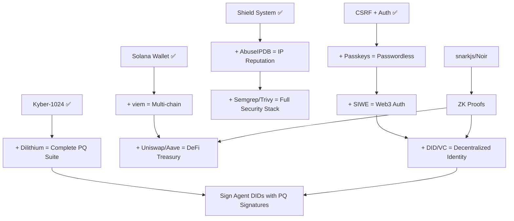

# ALFRED SECURITY, CRYPTOGRAPHY, BLOCKCHAIN & IDENTITY — UPGRADE RESEARCH
### Comprehensive Tool/SDK Investigation for Project Sovereignty
### Research Date: March 6, 2026

---

## QUICK REFERENCE — PRIORITY MATRIX

| Priority | Category | Top Pick | Impact |
|----------|----------|----------|--------|
| 🔴 P0 | Security Scanning | Semgrep + Trivy | Immediate vulnerability defense |
| 🔴 P0 | Authentication | Passkeys/WebAuthn | Replace passwords entirely |
| 🔴 P0 | Post-Quantum Signatures | CRYSTALS-Dilithium | Complete PQ suite (you have Kyber) |
| 🟠 P1 | Decentralized Identity | DID + Verifiable Credentials | Agent-to-agent identity |
| 🟠 P1 | Multi-chain | viem + ethers.js | EVM chain expansion |
| 🟠 P1 | Zero-Knowledge Proofs | Noir + snarkjs | Privacy-preserving computation |
| 🟡 P2 | DeFi Protocols | Uniswap v4 + Aave v3 | Autonomous treasury |
| 🟡 P2 | Threat Intelligence | VirusTotal + AbuseIPDB | Real-time threat feeds |
| 🟡 P2 | Smart Contracts | Hardhat 3 + Foundry | On-chain agent economy |
| 🟢 P3 | Privacy | Microsoft SEAL (HE) | Future-proofing |

---

## 1. ZERO-KNOWLEDGE PROOFS

> **Why Alfred needs this:** Privacy-preserving verification — prove a user has permission without revealing their identity. Prove solvency without exposing balances. Enable private voting in DAOs. ZK is the bridge between Alfred's `CIPHER` security team and `ATLAS` financial autonomy.

### 1.1 circom + snarkjs

| Field | Details |
|-------|---------|
| **What it does** | circom is a domain-specific language for writing arithmetic circuits. snarkjs is the JavaScript/WASM runtime that generates and verifies zk-SNARK proofs (Groth16, PLONK, FFLONK) from circom circuits |
| **License** | GPL-3.0 (snarkjs), GPL-3.0 (circom) — fully open source |
| **Cost** | Free |
| **Maturity** | Production — v0.7.6 (snarkjs), v2.2.3 (circom). Used by Polygon zkEVM, Semaphore, iden3. 2k+ stars, 8k+ dependents |
| **Language** | Rust (circom compiler), JavaScript/WASM (snarkjs runtime) |
| **Integration** | `npm install snarkjs` — works in Node.js AND browser. Compile circuits with circom CLI, generate proofs with snarkjs API. Can export Solidity verifier contracts |
| **circomlib** | Library of 100+ pre-built circuit templates: Poseidon hash, EdDSA signatures, Merkle trees, comparators, SHA256, MiMC |
| **Key API** | `snarkjs.groth16.fullProve(input, wasm, zkey)` → proof + public signals; `snarkjs.groth16.verify(vkey, signals, proof)` → boolean |
| **Alfred Use Cases** | Private credential verification, solvency proofs for treasury, anonymous voting in fleet consensus, ZK-authentication |
| **Priority** | 🟠 **P1** — foundational ZK infrastructure |

```javascript
// Example: Verify a ZK proof in Alfred's API
const snarkjs = require("snarkjs");
const { proof, publicSignals } = await snarkjs.groth16.fullProve(
    { secret: userSecret, nullifier: actionNullifier },
    "membership.wasm", "membership_final.zkey"
);
const valid = await snarkjs.groth16.verify(verificationKey, publicSignals, proof);
```

### 1.2 Noir (by Aztec)

| Field | Details |
|-------|---------|
| **What it does** | Rust-like DSL for writing ZK programs. Compiles to ACIR (intermediate representation), then to proving backend. Backend-agnostic — defaults to Barretenberg (PLONK-based), can target others |
| **License** | MIT/Apache 2.0 dual license |
| **Cost** | Free |
| **Maturity** | v1.0.0-beta.19 — rapidly advancing. Powers Aztec private smart contracts |
| **Language** | Rust-like syntax, compiles to ACIR |
| **Integration** | `noirup` CLI installer. `nargo` for compilation/testing. JavaScript bindings via `@noir-lang/noir_js` for browser/Node.js proof generation and verification |
| **Key Advantage** | Much simpler syntax than circom. No need to understand circuits — write normal-looking code. Built-in standard library with hash functions, ECDSA, Schnorr |
| **Alfred Use Cases** | Private computation proofs for agent tasks, confidential credential verification, private DeFi operations |
| **Priority** | 🟠 **P1** — preferred over circom for new development due to ergonomics |

```noir
// Example Noir program — prove knowledge of a preimage
fn main(x: Field, y: pub Field) {
    let hash = std::hash::pedersen_hash([x]);
    assert(hash == y);
}
```

### 1.3 zk-STARKs (StarkNet / Cairo)

| Field | Details |
|-------|---------|
| **What it does** | Transparent (no trusted setup), post-quantum secure ZK proofs. Larger proofs but no ceremony needed. Cairo is the language for StarkNet |
| **License** | Apache 2.0 (Cairo), MIT (stone-prover) |
| **Cost** | Free tooling; StarkNet has gas costs for on-chain verification |
| **Maturity** | Production — StarkNet mainnet live. Cairo 1.0 stable |
| **Integration** | `pip install cairo-lang` or Scarb package manager. StarkNet SDK for JS/Python |
| **Alfred Use Cases** | Post-quantum ZK proofs (future-proof), StarkNet DeFi integration |
| **Priority** | 🟡 **P2** — evaluate after snarkjs/Noir are integrated |

### 1.4 PLONK

| Field | Details |
|-------|---------|
| **What it does** | Universal SNARK — single trusted setup works for any circuit (unlike Groth16 which needs per-circuit setup). Already supported by snarkjs |
| **Integration** | Built into snarkjs: `snarkjs plonk setup`, `snarkjs plonk prove`, `snarkjs plonk verify` |
| **Alfred Use Cases** | Simpler deployment — no per-circuit ceremony needed |
| **Priority** | 🟠 **P1** — use PLONK mode in snarkjs by default over Groth16 |

### ZK Recommendation for Alfred
**Start with Noir** for new ZK programs (best developer experience), use **snarkjs with PLONK** for browser-side verification and Solidity export. Both integrate via npm/Node.js which matches Alfred's stack.

---

## 2. DECENTRALIZED IDENTITY

> **Why Alfred needs this:** Each of Alfred's 100 agents needs a verifiable identity. Users need portable, self-sovereign credentials. Agent-to-agent trust requires cryptographic identity. DIDs replace centralized auth for the sovereignty pillar.

### 2.1 W3C DID (Decentralized Identifiers) v1.0

| Field | Details |
|-------|---------|
| **What it does** | W3C Recommendation (July 2022) for globally unique, cryptographically verifiable identifiers. Format: `did:method:specific-id`. Resolves to DID Documents containing public keys, authentication methods, and service endpoints |
| **License** | Open standard — W3C Recommendation |
| **Cost** | Free (standard specification) |
| **Key Concepts** | DID Documents describe verification methods (public keys), authentication relationships, key agreement, capability invocation, capability delegation, and services |
| **DID Methods** | `did:key` (purely generative, no registry), `did:web` (uses DNS), `did:ethr` (Ethereum-based), `did:sol` (Solana-based), `did:ion` (Bitcoin-anchored) |
| **Integration** | JS libraries: `did-resolver`, `did-jwt`, `ethr-did-resolver`, `key-did-resolver`. npm packages |
| **Alfred Use Cases** | Each agent gets a DID → agent-to-agent authentication, portable identity across platforms, self-sovereign user identity |
| **Priority** | 🟠 **P1** — foundational for agent-to-agent economy |

```javascript
// Example DID Document for Alfred Agent "CIPHER"
{
  "@context": "https://www.w3.org/ns/did/v1",
  "id": "did:web:gositeme.com:agents:cipher",
  "authentication": [{
    "id": "did:web:gositeme.com:agents:cipher#key-1",
    "type": "Ed25519VerificationKey2020",
    "controller": "did:web:gositeme.com:agents:cipher",
    "publicKeyMultibase": "z6Mkf5rGMoatrSj1f..."
  }],
  "service": [{
    "id": "did:web:gositeme.com:agents:cipher#comms",
    "type": "EncryptedMessaging",
    "serviceEndpoint": "wss://gositeme.com:3010/agents/cipher"
  }]
}
```

### 2.2 Verifiable Credentials (W3C VC Data Model)

| Field | Details |
|-------|---------|
| **What it does** | Standard for cryptographically signed, tamper-evident digital credentials. Issuer → Holder → Verifier model. JSON-LD or JWT format |
| **License** | Open standard (W3C Recommendation) |
| **Cost** | Free |
| **Integration** | `@veramo/core` (TypeScript framework for DIDs + VCs), `@sphereon/ssi-sdk`, or `@spruceid/didkit` |
| **Alfred Use Cases** | Issue credentials for user permissions, agent capability proofs, enterprise SSO credentials, marketplace seller verification |
| **Priority** | 🟠 **P1** — pairs with DIDs |

### 2.3 SIWE (Sign-In with Ethereum) — EIP-4361

| Field | Details |
|-------|---------|
| **What it does** | Authentication standard using Ethereum wallet signatures. User signs a message with their wallet → server verifies signature → authenticated session. No passwords, no OAuth middleman |
| **License** | Apache 2.0 / MIT |
| **Cost** | Free |
| **Maturity** | Production — used by ENS, Snapshot, MetaMask, WalletConnect, Ceramic, Privy |
| **Integration** | `npm install siwe` — server-side verification. Frontend uses ethers.js/viem to request wallet signature. Supports EIP-1271 (smart contract wallets) |
| **Key Libraries** | `siwe` (JS), `siwe-py` (Python), `oidc-siwe` (bridges to OpenID Connect) |
| **Alfred Use Cases** | Web3-native login for Alfred dashboard, wallet-based authentication for crypto features, replace password auth for crypto-native users |
| **Priority** | 🟠 **P1** — instant integration with existing Solana wallet + extend to EVM |

```javascript
// Server-side SIWE verification
const { SiweMessage } = require('siwe');
const message = new SiweMessage(req.body.message);
const { data: fields } = await message.verify({ signature: req.body.signature });
// fields.address is the authenticated Ethereum address
```

### 2.4 Ceramic Network

| Field | Details |
|-------|---------|
| **What it does** | Decentralized data network for composable, user-owned data. Event streaming protocol. Stores mutable data (profiles, social graphs, app data) anchored to blockchains. Uses DIDs for authentication |
| **License** | MIT / Apache 2.0 |
| **Cost** | Free (run your own node) or use hosted providers |
| **Maturity** | Production — Ceramic One (Rust implementation) available. Powers ComposeDB |
| **Integration** | `@ceramicnetwork/http-client`, ComposeDB GraphQL SDK |
| **Alfred Use Cases** | Decentralized user profiles, portable agent configurations, cross-platform data |
| **Priority** | 🟡 **P2** — after DID foundation is built |

### 2.5 ENS (Ethereum Name Service)

| Field | Details |
|-------|---------|
| **What it does** | Human-readable names for Ethereum addresses (e.g., `alfred.eth`). Also resolves to IPFS content, other addresses, text records |
| **License** | MIT |
| **Cost** | Registration fee (~$5/yr for 5+ char names) + gas |
| **Integration** | `ethers.provider.resolveName("alfred.eth")`, viem has built-in ENS support |
| **Alfred Use Cases** | `alfred.eth` as brand identity, agent naming (`cipher.alfred.eth`), payment routing |
| **Priority** | 🟡 **P2** — nice-to-have branding |

### 2.6 Polygon ID (formerly iden3)

| Field | Details |
|-------|---------|
| **What it does** | ZK-based identity framework. Issue and verify credentials with zero-knowledge proofs — prove attributes without revealing data. Built on circom/snarkjs |
| **License** | Apache 2.0 / GPL-3.0 (components vary) |
| **Cost** | Free |
| **Integration** | `@0xpolygonid/js-sdk`, Polygon ID verifier SDK, issuer node |
| **Alfred Use Cases** | Age verification without revealing DOB, permission proofs without revealing identity, KYC without data exposure |
| **Priority** | 🟡 **P2** — after ZK foundation is built |

### 2.7 Worldcoin / World ID

| Field | Details |
|-------|---------|
| **What it does** | Proof-of-personhood using iris biometrics (no biometric data stored — only iris hash). Proves "unique human" via ZK proofs. World ID protocol |
| **License** | MIT (SDKs) |
| **Cost** | Free to integrate |
| **Integration** | `@worldcoin/idkit` (React widget), REST API verification |
| **Alfred Use Cases** | Anti-bot verification, sybil resistance for marketplace, human verification for sensitive operations |
| **Priority** | 🟢 **P3** — niche use case |

---

## 3. MULTI-CHAIN INTEGRATION

> **Why Alfred needs this:** Alfred has Solana. The EVM ecosystem (Ethereum, Polygon, Base, Arbitrum) holds 80%+ of DeFi TVL. Multi-chain = maximum financial autonomy.

### 3.1 viem

| Field | Details |
|-------|---------|
| **What it does** | TypeScript interface for Ethereum/EVM chains. Modern replacement for ethers.js/web3.js. Tree-shakeable, type-safe, lightweight |
| **License** | MIT |
| **Cost** | Free |
| **Maturity** | Production — 6k+ stars, powers wagmi, RainbowKit, ConnectKit |
| **Size** | 35kB min+gzip (vs 116kB ethers.js) |
| **Integration** | `npm install viem` — create client, read/write contracts, handle events. Built-in ENS, multicall, ABIs |
| **Chains Supported** | Ethereum, Polygon, Base, Arbitrum, Optimism, zkSync, Avalanche, BSC, + any EVM chain |
| **Key Advantage** | Superior TypeScript types, better error messages, modular architecture, active development |
| **Alfred Use Cases** | Read balances, send transactions, interact with DeFi contracts, deploy contracts, cross-chain bridges |
| **Priority** | 🟠 **P1** — primary EVM library |

```typescript
import { createPublicClient, http } from 'viem';
import { mainnet } from 'viem/chains';

const client = createPublicClient({ chain: mainnet, transport: http() });
const balance = await client.getBalance({ address: '0x...' });
```

### 3.2 ethers.js v6

| Field | Details |
|-------|---------|
| **What it does** | Complete Ethereum library — wallets, providers, contracts, ENS, utilities |
| **License** | MIT |
| **Cost** | Free |
| **Maturity** | Production — 8k+ stars, most widely used Ethereum library. v6 is current |
| **Integration** | `npm install ethers` — Providers, Signers, Contracts pattern |
| **Alfred Use Cases** | Fallback/alternative to viem, extensive documentation, proven track record |
| **Priority** | 🟡 **P2** — viem preferred, ethers.js as fallback |

### 3.3 Chain-Specific Notes

| Chain | RPC Endpoint | DEX | Notable |
|-------|-------------|-----|---------|
| **Ethereum** | Infura, Alchemy, public RPCs | Uniswap v3/v4 | Highest security, highest gas |
| **Polygon** | polygon-rpc.com, Alchemy | QuickSwap, Uniswap v3 | Low gas, fast finality |
| **Base** | Coinbase-backed L2 | Aerodrome, Uniswap v3 | Growing fast, Coinbase ecosystem |
| **Arbitrum** | Arbitrum One RPC | Camelot, GMX, Uniswap v3 | Largest L2 by TVL |
| **Optimism** | Optimism RPC | Velodrome | OP Stack, superchain |
| **TON** | ton-api.com | STON.fi, DeDust | Telegram ecosystem, different VM (not EVM) |
| **Cosmos** | CosmJS SDK | Osmosis | IBC protocol, different ecosystem |

### 3.4 TON (The Open Network)

| Field | Details |
|-------|---------|
| **What it does** | Telegram's blockchain. TVM (not EVM). Massive user base via Telegram bots/mini-apps |
| **License** | LGPLv2 |
| **Integration** | `@ton/ton` SDK (TypeScript), `tonconnect` for wallet auth |
| **Alfred Use Cases** | Telegram bot payments, mini-app marketplace, tap-to-earn for Alfred gamification |
| **Priority** | 🟡 **P2** — large user base makes it attractive |

### 3.5 Cosmos (CosmJS)

| Field | Details |
|-------|---------|
| **What it does** | SDK for Cosmos ecosystem chains. IBC (Inter-Blockchain Communication) for cross-chain transfers |
| **License** | Apache 2.0 |
| **Integration** | `npm install @cosmjs/stargate` |
| **Alfred Use Cases** | Access Cosmos DeFi (Osmosis), cross-chain interoperability |
| **Priority** | 🟢 **P3** — lower priority than EVM chains |

---

## 4. DeFi PROTOCOLS

> **Why Alfred needs this:** The `ATLAS` Financial Director and treasury management. Autonomous yield generation, liquidity provision, lending/borrowing for treasury optimization.

### 4.1 Uniswap (v3/v4)

| Field | Details |
|-------|---------|
| **What it does** | Largest DEX on Ethereum/EVM. Automated Market Maker (AMM). v4 introduces hooks for custom pool logic |
| **License** | BSL 1.1 (v3/v4 source), MIT (periphery/SDK) |
| **Cost** | 0.01–1% swap fee (pool dependent) |
| **Integration** | `@uniswap/v3-sdk`, `@uniswap/smart-order-router`. Use viem/ethers to call Router contract |
| **Deployed On** | Ethereum, Polygon, Arbitrum, Optimism, Base, BNB Chain, Avalanche |
| **Alfred Use Cases** | Token swaps for treasury rebalancing, provide liquidity for yield, price oracle via TWAP |
| **Priority** | 🟡 **P2** — after EVM integration is stable |

### 4.2 Aave v3

| Field | Details |
|-------|---------|
| **What it does** | Largest lending/borrowing protocol. Supply assets to earn yield, borrow against collateral. Flash loans. Cross-chain via Aave v3 portals |
| **License** | BSL 1.1 |
| **Cost** | Variable interest rates (supply APY: 1–8%, borrow APY: 2–15%) |
| **Integration** | `@aave/contract-helpers`, `@aave/math-utils`. Direct contract calls via viem |
| **Deployed On** | Ethereum, Polygon, Arbitrum, Optimism, Avalanche, Base |
| **Alfred Use Cases** | Earn yield on idle treasury, borrow stablecoins against crypto holdings, flash loans for arbitrage |
| **Priority** | 🟡 **P2** |

### 4.3 Compound v3 (Comet)

| Field | Details |
|-------|---------|
| **What it does** | Simplified lending protocol. Single-asset markets (e.g., supply USDC, borrow against ETH/WBTC) |
| **License** | BSL 1.1 |
| **Cost** | Variable interest rates |
| **Integration** | Comet contract interface, simple `supply()` / `withdraw()` / `borrow()` calls |
| **Alfred Use Cases** | Simpler than Aave — good starting point for treasury lending |
| **Priority** | 🟡 **P2** — alternative to Aave |

### 4.4 MakerDAO / Sky

| Field | Details |
|-------|---------|
| **What it does** | Stablecoin protocol (DAI). Collateralized debt positions. DSR (DAI Savings Rate) for yield |
| **License** | AGPL-3.0 |
| **Integration** | Direct contract calls to DSR module |
| **Alfred Use Cases** | Earn DSR yield on stablecoin treasury (currently ~5-8% APY) |
| **Priority** | 🟡 **P2** |

### 4.5 Solana DeFi (Already Adjacent)

| Protocol | Status | Notes |
|----------|--------|-------|
| **Jupiter** | ✅ Integrated | Aggregator — best execution across all Solana DEXs |
| **Raydium** | Available | AMM + order book hybrid, concentrated liquidity |
| **Orca** | Available | Concentrated liquidity AMM (Whirlpools) |
| **Marinade** | Available | Liquid staking (mSOL) — earn staking yield |
| **Drift** | Available | Perpetual DEX — advanced trading |

### DeFi Recommendation for Alfred
Start with **Uniswap v3 + Aave v3** on Ethereum/Base. Use Jupiter (already integrated) on Solana. Build a unified treasury API that abstracts chain-specific details.

---

## 5. SECURITY SCANNING

> **Why Alfred needs this:** Alfred's `CIPHER` director (Agent 20-28) needs automated vulnerability scanning. These tools should run in CI/CD and as autonomous scanning agents.

### 5.1 Semgrep

| Field | Details |
|-------|---------|
| **What it does** | Static Application Security Testing (SAST). Pattern-matching code analysis. 3,000+ rules for security, correctness, performance. Supports PHP, JavaScript, Python, TypeScript, Go, Java, and 25+ more |
| **License** | LGPL-2.1 (OSS engine) |
| **Cost** | Free (CLI), Team ($40/dev/mo), Enterprise (custom) |
| **Integration** | `pip install semgrep` or `brew install semgrep`. CLI: `semgrep --config auto .`. CI/CD: GitHub Actions, GitLab CI, pre-commit hooks. JSON/SARIF output |
| **Key Advantage** | Custom rules in YAML — can write Alfred-specific security patterns. Fast (10-100x faster than legacy SAST). Low false-positive rate |
| **Alfred Use Cases** | Scan all PHP/JS/Python for SQL injection, XSS, path traversal, hardcoded secrets. Custom rules for Alfred API patterns. Agent 25 (Inspector) automation |
| **Priority** | 🔴 **P0** — deploy immediately |

```bash
# Scan Alfred's PHP codebase for security issues
semgrep --config p/php-security --config p/owasp-top-ten /path/to/alfred/
```

### 5.2 Trivy

| Field | Details |
|-------|---------|
| **What it does** | Comprehensive security scanner — container images, filesystems, git repos, Kubernetes, IaC. Finds OS package vulns, language-specific vulns (npm, pip, composer), misconfigurations, secrets |
| **License** | Apache 2.0 |
| **Cost** | Free |
| **Maturity** | Production — CNCF project, 25k+ stars |
| **Integration** | `apt install trivy` or `brew install trivy`. CLI: `trivy fs /path/to/project`. CI/CD: GitHub Actions, GitLab. JSON/SARIF/table output |
| **Alfred Use Cases** | Scan dependencies (npm, composer, pip), find vulnerable packages, scan Docker images, detect hardcoded keys |
| **Priority** | 🔴 **P0** — deploy immediately alongside Semgrep |

### 5.3 GitLeaks / TruffleHog

| Field | Details |
|-------|---------|
| **GitLeaks** | Scans git history for secrets (API keys, passwords, tokens). 170+ regex patterns. Go binary. `gitleaks detect --source .` |
| **TruffleHog** | More advanced — scans git, S3, filesystem. Verifies secrets are active (actually calls APIs). Python/Go. `trufflehog git file://.` |
| **License** | Both MIT |
| **Cost** | Free |
| **Alfred Use Cases** | Pre-commit hook to prevent secret leaks, audit git history for exposed API keys (OpenAI, Stripe, Groq, etc.) |
| **Priority** | 🔴 **P0** — critical for a platform with 12+ API keys |

### 5.4 OWASP ZAP

| Field | Details |
|-------|---------|
| **What it does** | Dynamic Application Security Testing (DAST). Proxies HTTP traffic, finds runtime vulnerabilities: XSS, SQL injection, CSRF, broken auth. Spider/crawler + active scanner |
| **License** | Apache 2.0 |
| **Cost** | Free |
| **Integration** | Docker: `docker run owasp/zap2docker-stable`. API: RESTful control. Can script with Python via `python-owasp-zap-v2.4` |
| **Alfred Use Cases** | Scan Alfred's web endpoints, test API security, automated penetration testing. Agent 20 (Sentinel) automation |
| **Priority** | 🟠 **P1** — schedule weekly scans |

### 5.5 Snyk

| Field | Details |
|-------|---------|
| **What it does** | Developer security platform. SCA (Software Composition Analysis), SAST, container scanning, IaC. Extensive vulnerability database |
| **License** | Proprietary (free tier available) |
| **Cost** | Free (200 tests/month), Team ($25/dev/mo), Enterprise (custom) |
| **Integration** | `npm install -g snyk && snyk test`. GitHub integration, IDE plugins |
| **Alfred Use Cases** | Continuous dependency monitoring, PR checks for vulnerable packages |
| **Priority** | 🟠 **P1** — complement Trivy with continuous monitoring |

### 5.6 npm audit / Dependabot

| Field | Details |
|-------|---------|
| **npm audit** | Built-in: `npm audit --json`. Checks npm dependencies against GitHub Advisory Database. Free |
| **Dependabot** | GitHub-native: auto-creates PRs for outdated/vulnerable dependencies. Supports npm, pip, composer, Gradle. Free for public/private repos |
| **Alfred Use Cases** | Automated PR creation for vulnerable deps, low-effort continuous protection |
| **Priority** | 🔴 **P0** — enable Dependabot today (zero effort) |

### Security Scanning Stack for Alfred
```
LAYER 1 (P0 — TODAY):     Semgrep (SAST) + Trivy (SCA) + GitLeaks (secrets) + Dependabot (deps)
LAYER 2 (P1 — THIS MONTH): OWASP ZAP (DAST) + Snyk (continuous monitoring)
LAYER 3 (ONGOING):         Custom Semgrep rules for Alfred-specific patterns
```

---

## 6. AUTHENTICATION

> **Why Alfred needs this:** Replace password-based auth with cryptographic identity. Passkeys are the future standard — Apple, Google, Microsoft all pushing. Alfred's `Warden` (Agent 22) and `Locksmith` (Agent 27) manage this.

### 6.1 Passkeys / WebAuthn (FIDO2)

| Field | Details |
|-------|---------|
| **What it does** | Passwordless authentication using public-key cryptography. Device creates keypair, stores private key in secure element (TPM/Secure Enclave). Server stores only public key. Phishing-resistant |
| **License** | W3C/FIDO Alliance standard — open |
| **Cost** | Free |
| **Maturity** | Production — supported by all major browsers + platforms (iOS 16+, Android 14+, Windows 10+, macOS Ventura+) |
| **Integration** | Server: `@simplewebauthn/server` (Node.js), `webauthn-framework/webauthn-lib` (PHP). Client: `@simplewebauthn/browser` or native `navigator.credentials.create()` / `navigator.credentials.get()` |
| **Key Advantage** | Unphishable, no shared secrets, no password database to breach. Synced passkeys (iCloud Keychain, Google Password Manager) allow cross-device |
| **Alfred Use Cases** | Primary auth for dashboard, admin panel, developer portal. Pairs with existing CSRF protection |
| **Priority** | 🔴 **P0** — deploy as primary auth method |

```php
// Server-side WebAuthn verification (PHP)
use Webauthn\Server;
$server = new Server($rpEntity, $credentialRepository, $metadataService);
$publicKeyCredentialSource = $server->loadAndCheckAssertionResponse(
    $data, $credentialRequest, $userEntity, $request
);
// User is now authenticated — no password involved
```

### 6.2 OAuth 2.1

| Field | Details |
|-------|---------|
| **What it does** | Consolidated OAuth standard (merges OAuth 2.0 + best practices). Mandates PKCE, removes implicit grant, requires TLS everywhere |
| **License** | IETF standard — open |
| **Cost** | Free to implement |
| **Integration** | `league/oauth2-server` (PHP), `openid-client` (Node.js) |
| **Alfred Use Cases** | Third-party app authorization (Developer Portal API), marketplace OAuth |
| **Priority** | 🟠 **P1** — for developer API access |

### 6.3 OpenID Connect (OIDC)

| Field | Details |
|-------|---------|
| **What it does** | Identity layer on top of OAuth 2.0. Provides ID tokens (JWT) with user info claims. Discovery, dynamic registration, session management |
| **License** | OpenID Foundation standard — open |
| **Integration** | `openid-client` (Node.js), `jumbojett/OpenID-Connect-PHP` (PHP) |
| **Alfred Use Cases** | SSO for enterprise customers, federated identity with Google/Microsoft/GitHub |
| **Priority** | 🟠 **P1** — enterprise requirement |

### 6.4 Keycloak

| Field | Details |
|-------|---------|
| **What it does** | Open-source IAM (Identity and Access Management). Supports OIDC, OAuth 2.0, SAML 2.0, LDAP, social login. User federation, fine-grained authorization, MFA |
| **License** | Apache 2.0 |
| **Cost** | Free (self-hosted) |
| **Maturity** | Production — CNCF incubating project, used by Red Hat, massive community |
| **Integration** | Docker deployment → configure realms/clients → connect Alfred via OIDC adapter |
| **Alfred Use Cases** | Central identity provider for all Alfred services, enterprise SSO, RBAC, MFA management. Already have enterprise-admin.php — Keycloak backs it |
| **Priority** | 🟠 **P1** — ideal for enterprise tier |

### 6.5 Clerk

| Field | Details |
|-------|---------|
| **What it does** | Drop-in authentication UI + backend. Passkeys, email magic links, social login, MFA, organizations. Pre-built React/Next.js components |
| **License** | Proprietary |
| **Cost** | Free (10k MAU), Pro ($25/mo + $0.02/MAU), Enterprise (custom) |
| **Integration** | `@clerk/nextjs` — 5-minute setup. REST API for PHP backend |
| **Alfred Use Cases** | Fastest path to modern auth UI, good for developer portal |
| **Priority** | 🟡 **P2** — if self-hosted solutions are too heavy |

### 6.6 Auth0

| Field | Details |
|-------|---------|
| **What it does** | IDaaS (Identity as a Service). Universal login, social connections, MFA, breached password detection, bot detection. Extensive SDKs |
| **License** | Proprietary |
| **Cost** | Free (25k MAU), Essential ($35/mo), Professional ($240/mo), Enterprise (custom) |
| **Integration** | `auth0-php` SDK, `@auth0/auth0-spa-js` for frontend |
| **Alfred Use Cases** | Enterprise-grade auth without running Keycloak |
| **Priority** | 🟡 **P2** — Keycloak preferred for sovereignty |

### Auth Recommendation for Alfred
**Passkeys (P0)** for user-facing auth + **Keycloak (P1)** for enterprise IAM + **SIWE (P1)** for crypto-native users. This covers all user types: consumers, enterprises, and web3 users.

---

## 7. PRIVACY

> **Why Alfred needs this:** Processing user data (voice, conversations, financial) while maintaining privacy guarantees. Federated learning for improving AI without centralizing data. Homomorphic encryption for computing on encrypted data.

### 7.1 Homomorphic Encryption — Microsoft SEAL

| Field | Details |
|-------|---------|
| **What it does** | Compute on encrypted data without decrypting it. Supports BFV (integer arithmetic) and CKKS (approximate real-number arithmetic) schemes |
| **License** | MIT |
| **Cost** | Free |
| **Maturity** | Production — by Microsoft Research. v4.1. Used in production privacy systems |
| **Language** | C++ library, wrappers for .NET. Community wrappers for Python (`tenseal`), Node.js (`node-seal`) |
| **Integration** | `npm install node-seal` or `pip install tenseal` |
| **Speed** | 100-10,000x slower than plaintext operations — suitable for specific use cases only |
| **Alfred Use Cases** | Private analytics (aggregate user behavior without seeing individual data), encrypted financial computations, privacy-preserving AI inference |
| **Priority** | 🟢 **P3** — research phase, not production-ready for real-time use |

### 7.2 Concrete ML (by Zama)

| Field | Details |
|-------|---------|
| **What it does** | Machine learning on encrypted data. Converts scikit-learn and PyTorch models to run on FHE (Fully Homomorphic Encryption). Automatic encryption/decryption |
| **License** | BSD-3 |
| **Cost** | Free (open source), Enterprise support available |
| **Integration** | `pip install concrete-ml`. Drop-in replacement for sklearn models: `model = ConcreteRandomForestClassifier()` |
| **Alfred Use Cases** | Private AI inference — user data stays encrypted during processing. Classified document analysis |
| **Priority** | 🟢 **P3** — bleeding edge |

### 7.3 Differential Privacy

| Field | Details |
|-------|---------|
| **What it does** | Mathematical framework for adding calibrated noise to data/queries to protect individual privacy while maintaining aggregate accuracy |
| **Key Libraries** | `opendp` (Rust/Python), Google's `dp-accounting`, Apple's framework |
| **License** | MIT/Apache |
| **Cost** | Free |
| **Integration** | `pip install opendp` — privacy-preserving aggregation queries |
| **Alfred Use Cases** | Privacy-preserving analytics, user behavior analysis without individual tracking, compliant data sharing |
| **Priority** | 🟡 **P2** — important for enterprise/compliance |

### 7.4 Federated Learning

| Field | Details |
|-------|---------|
| **What it does** | Train ML models across decentralized data sources without centralizing data. Each device/server trains locally, shares only model gradients |
| **Key Libraries** | `flower` (Python, most popular), `pysyft` (OpenMined), `tensorflow-federated` |
| **License** | Apache 2.0 (Flower) |
| **Cost** | Free |
| **Integration** | `pip install flwr`. Define client strategy, aggregation server |
| **Alfred Use Cases** | Improve Alfred across user fleets without collecting conversational data centrally. Enterprise clients train on their own data |
| **Priority** | 🟡 **P2** — strong enterprise value proposition |

### 7.5 Secure Enclaves (SGX / TrustZone)

| Field | Details |
|-------|---------|
| **Intel SGX** | Hardware-isolated execution environment. Code runs in encrypted memory that even the OS/hypervisor can't access. Used for key management, secret computation |
| **ARM TrustZone** | Secure world / normal world separation on ARM processors. Used in mobile devices, IoT |
| **Cloud Options** | Azure Confidential Computing (SGX-based), AWS Nitro Enclaves, GCP Confidential VMs (AMD SEV) |
| **Integration** | Requires specific hardware. Cloud: use Azure DCsv3 VMs or AWS Nitro. SDKs: Open Enclave SDK, Gramine (run unmodified Linux apps in SGX) |
| **Alfred Use Cases** | Protect encryption keys, run sensitive financial operations in hardware-isolated environments, secure key management for wallets |
| **Priority** | 🟢 **P3** — requires infrastructure changes |

---

## 8. THREAT INTELLIGENCE

> **Why Alfred needs this:** Agent 28 (`Watchdog`) needs real-time threat feeds. Proactive security monitoring for the Shield system. Detect compromised IPs, malicious files, and active threats.

### 8.1 VirusTotal API

| Field | Details |
|-------|---------|
| **What it does** | Scans files, URLs, IPs, domains against 70+ antivirus engines and URL/domain blocklists. Returns detection results, behavioral analysis, community votes |
| **License** | Proprietary API |
| **Cost** | Free (4 req/min, 500 req/day), Premium ($10k+/yr for higher quotas) |
| **Integration** | REST API: `POST https://www.virustotal.com/api/v3/files` with `x-apikey` header. Node.js: `node-fetch` / `axios`. PHP: `curl` |
| **Alfred Use Cases** | Scan uploaded files before processing, check URLs in messages, validate download links, scan marketplace tool submissions |
| **Priority** | 🟡 **P2** — important for marketplace safety |

```javascript
// Scan a URL with VirusTotal
const response = await fetch('https://www.virustotal.com/api/v3/urls', {
    method: 'POST',
    headers: { 'x-apikey': VT_API_KEY, 'Content-Type': 'application/x-www-form-urlencoded' },
    body: `url=${encodeURIComponent(urlToScan)}`
});
```

### 8.2 AbuseIPDB

| Field | Details |
|-------|---------|
| **What it does** | IP address reputation database. Check if an IP has been reported for malicious activity (DDoS, brute force, spam, port scanning). Report abusive IPs |
| **License** | Proprietary API |
| **Cost** | Free (1,000 checks/day), Premium ($19.99–199.99/mo) |
| **Integration** | REST API: `GET https://api.abuseipdb.com/api/v2/check?ipAddress=X` |
| **Alfred Use Cases** | Enhance Shield DDoS protection — auto-block IPs with high abuse scores. Feed into rate limiter decisions. Report attacking IPs |
| **Priority** | 🟡 **P2** — directly enhances existing Shield system |

### 8.3 Shodan

| Field | Details |
|-------|---------|
| **What it does** | Search engine for internet-connected devices. Finds exposed services, open ports, vulnerabilities, SSL certificate info. Monitor your own attack surface |
| **License** | Proprietary API |
| **Cost** | Free (limited), Membership ($49 one-time), API ($59/mo), Enterprise (custom) |
| **Integration** | REST API + `shodan` Python CLI. Node.js: `shodan-client` npm package |
| **Alfred Use Cases** | Monitor GoSiteMe infrastructure exposure, find unintended open ports, track SSL certificate validity, competitive intelligence |
| **Priority** | 🟢 **P3** — useful but not critical |

### 8.4 abuse.ch / CIRCL

| Field | Details |
|-------|---------|
| **abuse.ch** | Free threat intelligence feeds: URLhaus (malicious URLs), MalwareBazaar (malware samples), ThreatFox (IOCs), Feodo Tracker (C2 servers) |
| **CIRCL** | Computer Incident Response Center Luxembourg. Operates MISP (Malware Information Sharing Platform), free threat intelligence sharing |
| **License** | Free / CC0 (abuse.ch), Open source (MISP) |
| **Integration** | REST APIs, daily exports (CSV/JSON), Suricata/YARA rules |
| **Alfred Use Cases** | Block known malicious URLs in communications, detect C2 traffic, enhance Shield blocklists |
| **Priority** | 🟡 **P2** — free and high-value |

### Threat Intelligence Stack for Alfred
```
Shield Enhancement:  AbuseIPDB (IP reputation) → feed into rate limiter
Content Safety:      VirusTotal (file/URL scanning) → marketplace + comms
Threat Feeds:       abuse.ch URLhaus/ThreatFox → blocklist updates
Infrastructure:     Shodan (attack surface monitoring) → proactive scanning
```

---

## 9. SMART CONTRACTS

> **Why Alfred needs this:** The agent-to-agent economy, on-chain governance, automated escrow, and trust-minimized interactions between Alfred agents and external systems.

### 9.1 Hardhat 3

| Field | Details |
|-------|---------|
| **What it does** | Ethereum development environment. Compile, test, debug, deploy Solidity contracts. Local blockchain node. Plugin ecosystem. Currently in production-ready beta |
| **License** | MIT (Hardhat), BSL 1.1 (some plugins) |
| **Cost** | Free |
| **Maturity** | Production — most popular EVM dev framework. v3 is current. Uses viem by default |
| **Language** | TypeScript/JavaScript, Solidity |
| **Integration** | `npx hardhat --init`. Ignition deployment modules. Hardhat Network for local testing. TypeScript-first |
| **Key Features v3** | Native Solidity testing, gas statistics, code coverage, Hardhat Ignition (declarative deployments), multi-compiler support |
| **Alfred Use Cases** | Develop agent economy contracts (escrow, governance, staking), testing framework for smart contracts, contract deployment pipeline |
| **Priority** | 🟡 **P2** — when building on-chain agent economy |

### 9.2 Foundry

| Field | Details |
|-------|---------|
| **What it does** | Blazing-fast Solidity development toolkit written in Rust. Forge (testing), Cast (contract interaction), Anvil (local node), Chisel (REPL) |
| **License** | MIT / Apache 2.0 |
| **Cost** | Free |
| **Maturity** | Production — preferred by advanced Solidity developers |
| **Key Advantage** | Tests written in Solidity (not JS), 10-100x faster than Hardhat for compilation/testing, fuzz testing built-in, gas snapshots |
| **Integration** | `curl -L https://foundry.paradigm.xyz | bash && foundryup`. Solidity-native — no JavaScript required |
| **Alfred Use Cases** | Fast smart contract iteration, fuzz testing for contract security |
| **Priority** | 🟡 **P2** — use alongside Hardhat |

### 9.3 Anchor (Solana)

| Field | Details |
|-------|---------|
| **What it does** | Solana smart contract (program) framework. Rust macros that generate boilerplate for account serialization, instruction parsing, CPI |
| **License** | Apache 2.0 |
| **Cost** | Free |
| **Status** | ✅ **Already Adjacent** — Alfred has Solana wallet integration |
| **Integration** | `anchor init`, write programs in Rust with `#[program]` macros, test with Mocha/TypeScript |
| **Alfred Use Cases** | Build agent economy on Solana (lower costs than EVM), on-chain agent registries, SPL token governance |
| **Priority** | 🟠 **P1** — natural extension of existing Solana integration |

### 9.4 Cairo (StarkNet)

| Field | Details |
|-------|---------|
| **What it does** | Smart contract language for StarkNet. Rust-like syntax. Generates STARK proofs for every transaction — inherent privacy + scalability |
| **License** | Apache 2.0 |
| **Integration** | `scarb` package manager, `starknet-foundry` for testing |
| **Alfred Use Cases** | Privacy-preserving smart contracts, ZK-native on-chain logic |
| **Priority** | 🟢 **P3** — specialized |

### 9.5 Sui Move

| Field | Details |
|-------|---------|
| **What it does** | Object-centric smart contract language for Sui blockchain. Prevents common pitfalls (reentrancy, integer overflow). Built-in asset ownership model |
| **License** | Apache 2.0 |
| **Maturity** | Production — Sui mainnet live |
| **Integration** | `suiup install sui`, write contracts in Move, deploy with `sui client publish` |
| **Key Advantage** | Object-centric model (every item is an owned object) — natural fit for agent-to-agent asset transfers |
| **Alfred Use Cases** | Agent-owned assets, object-based economy (each tool/skill is an on-chain object), native parallel execution |
| **Priority** | 🟡 **P2** — interesting alternative to EVM |

---

## 10. POST-QUANTUM CRYPTOGRAPHY

> **Why Alfred needs this:** Alfred already has **Kyber-1024** for key encapsulation. But signatures, additional KEM options, and hash-based schemes are needed for a complete post-quantum suite. NIST has finalized standards.

### 10.1 CRYSTALS-Dilithium (ML-DSA — FIPS 204)

| Field | Details |
|-------|---------|
| **What it does** | NIST-standardized post-quantum digital signature scheme. Lattice-based. Replaces RSA/ECDSA for signing. Three security levels: ML-DSA-44 (128-bit), ML-DSA-65 (192-bit), ML-DSA-87 (256-bit) |
| **License** | Public domain (NIST standard) |
| **Cost** | Free |
| **Maturity** | **FIPS 204 — NIST Standard (Aug 2024)**. The primary recommended PQ signature scheme |
| **Performance** | Sign: ~500K ops/sec, Verify: ~350K ops/sec. Sig size: 2,420–4,627 bytes. Much faster than RSA |
| **Integration** | `liboqs` (C library by Open Quantum Safe), `oqs-provider` for OpenSSL, `pqcrypto` npm package, `crystals-dilithium` Python package |
| **Alfred Use Cases** | Sign API tokens, sign agent-to-agent messages, sign marketplace tool packages, quantum-resistant JWT signatures |
| **Priority** | 🔴 **P0** — completes Alfred's PQ suite alongside Kyber-1024 |

```javascript
// Post-quantum signature with liboqs Node.js binding
const oqs = require('liboqs-node');
const signer = new oqs.Signature('Dilithium3');
const keypair = signer.generateKeypair();
const signature = signer.sign(message);
const valid = signer.verify(message, signature, keypair.publicKey);
```

### 10.2 SPHINCS+ (SLH-DSA — FIPS 205)

| Field | Details |
|-------|---------|
| **What it does** | Hash-based digital signature scheme. Stateless. Conservative security — relies only on hash function security. NIST standardized |
| **License** | Public domain (NIST standard) |
| **Cost** | Free |
| **Maturity** | **FIPS 205 — NIST Standard (Aug 2024)** |
| **Performance** | Slower than Dilithium. Sign: ~1.5ms, Verify: ~0.5ms. Sig size: 7,856–49,856 bytes (large!) |
| **Key Advantage** | Most conservative security assumptions — if lattice crypto breaks, SPHINCS+ survives. Backup PQ signature scheme |
| **Integration** | `liboqs`, `pqcrypto` |
| **Alfred Use Cases** | Backup signature scheme, sign critical long-term documents/keys, diversity of PQ algorithms |
| **Priority** | 🟠 **P1** — backup to Dilithium for defense in depth |

### 10.3 BIKE (Bit-Flipping Key Encapsulation)

| Field | Details |
|-------|---------|
| **What it does** | Code-based KEM (Key Encapsulation Mechanism). NIST Round 4 candidate — not yet standardized. Alternative to Kyber for KEM |
| **License** | MIT |
| **Maturity** | Round 4 evaluation — not yet a standard |
| **Integration** | `liboqs` |
| **Alfred Use Cases** | Future alternative KEM if lattice-based crypto (Kyber) is ever compromised |
| **Priority** | 🟢 **P3** — monitor only until NIST decision |

### 10.4 Complete PQ Suite for Alfred

```
CURRENT:                        TARGET:
┌──────────────────────┐       ┌───────────────────────────────────────────┐
│ Kyber-1024 (ML-KEM)  │       │ Kyber-1024 (ML-KEM) — Key Encapsulation  │
│ ✅ Key encapsulation │       │ Dilithium3 (ML-DSA) — Digital Signatures │
│                      │       │ SPHINCS+-SHA2 (SLH-DSA) — Backup Sigs   │
│                      │       │ AES-256-GCM — Symmetric Encryption      │
│ AES-256-GCM          │       │ HMAC-SHA256 — Message Authentication    │
│ ✅ Symmetric          │       │ Argon2id — Password Hashing             │
│                      │       │ X25519 + Kyber768 Hybrid — Key Exchange  │
│ HMAC-SHA256          │       │                                          │
│ ✅ Token validation   │       │ STATUS: NIST-compliant full PQ suite     │
└──────────────────────┘       └──────────────────────────────────────────┘
```

---

## IMPLEMENTATION ROADMAP

### Phase 1: Immediate Security Hardening (Week 1-2)
| Tool | Action | Agent |
|------|--------|-------|
| Semgrep | Install, run full scan on PHP/JS/Python | Sentinel (20) |
| Trivy | Install, scan all dependencies | Inspector (25) |
| GitLeaks | Audit git history, add pre-commit hook | Vault (23) |
| Dependabot | Enable on GitHub repository | Deployer (17) |
| CRYSTALS-Dilithium | Add via liboqs, sign API tokens | Vault (23) |
| Passkeys/WebAuthn | Add to login flow alongside password | Locksmith (27) |

### Phase 2: Identity & Auth Layer (Week 3-6)
| Tool | Action | Agent |
|------|--------|-------|
| DID (did:web) | Create DID Documents for all 10 Directors | Warden (22) |
| SIWE | Add wallet-based login option | Locksmith (27) |
| Verifiable Credentials | Issue agent capability credentials | Warden (22) |
| Keycloak | Deploy for enterprise SSO | Warden (22) |
| OWASP ZAP | Set up weekly DAST scans | Sentinel (20) |
| AbuseIPDB | Integrate with Shield rate limiter | Shield (21) |

### Phase 3: Multi-Chain & ZK (Week 7-12)
| Tool | Action | Agent |
|------|--------|-------|
| viem | Add Ethereum/Base/Arbitrum/Polygon support | Atlas finance team |
| Noir / snarkjs | Build privacy-preserving credential verification | Vault (23) |
| Uniswap v3 SDK | Enable EVM DEX swaps for treasury | Atlas finance team |
| Aave v3 | Enable lending/yield for idle treasury | Atlas finance team |
| SPHINCS+ | Add backup PQ signatures | Vault (23) |
| Anchor (Solana) | Build on-chain agent registry | Forge (11) |

### Phase 4: Advanced Capabilities (Week 13-24)
| Tool | Action | Agent |
|------|--------|-------|
| Hardhat 3 / Foundry | Develop agent economy smart contracts | Forge (11) |
| VirusTotal | Integrate file/URL scanning for marketplace | Guardian (26) |
| Differential Privacy | Add to analytics engine | Auditor (24) |
| Federated Learning | Prototype federated model training | Scholar (29) |
| Ceramic Network | Decentralized user profiles | Warden (22) |
| Polygon ID | ZK credential verification | Vault (23) |

---

## COST SUMMARY

| Category | Tool | Annual Cost |
|----------|------|-------------|
| **Free/OSS** | Semgrep OSS, Trivy, GitLeaks, snarkjs, circom, Noir, viem, ethers.js, Hardhat, Foundry, Anchor, liboqs, SEAL, OpenDP, Flower, Keycloak, SIWE, DID libs, WebAuthn libs, npm audit, abuse.ch | **$0** |
| **Freemium** | Dependabot, AbuseIPDB (free tier), VirusTotal (free tier), Snyk (free tier) | **$0** (free tiers) |
| **Optional Paid** | Snyk Team ($300/yr/dev), Shodan API ($708/yr), VirusTotal Premium ($10k+/yr), Auth0/Clerk | **$1,000–12,000/yr** |
| **Infrastructure** | Keycloak hosting, additional RPC endpoints (Alchemy/Infura), ENS registration | **$500–2,000/yr** |

**Total minimum cost: $0** (all critical tools are open source)
**Recommended budget: $2,000–5,000/yr** (for premium threat intel + SaaS auth)

---

## ARCHITECTURE FIT — MAPPING TO ALFRED'S AGENT HIERARCHY

```
ALFRED (Supreme Commander)
├── CIPHER (Security Director)
│   ├── Sentinel (20) ← Semgrep, Trivy, OWASP ZAP
│   ├── Shield (21)   ← AbuseIPDB, abuse.ch feeds
│   ├── Warden (22)   ← DID, VCs, Keycloak, Passkeys
│   ├── Vault (23)    ← Dilithium, SPHINCS+, Kyber-1024, ZK proofs
│   ├── Auditor (24)  ← Differential privacy, audit trails
│   ├── Inspector (25)← GitLeaks, TruffleHog, Snyk
│   ├── Guardian (26) ← VirusTotal, content scanning
│   ├── Locksmith (27)← WebAuthn, SIWE, OAuth 2.1, OIDC
│   └── Watchdog (28) ← Shodan, AbuseIPDB, threat feeds
│
├── ATLAS (Finance Director)
│   ├── viem/ethers.js → multi-chain wallet management
│   ├── Uniswap/Aave  → DeFi treasury operations
│   ├── Jupiter       → ✅ already integrated (Solana)
│   └── Smart contracts→ agent-to-agent economy
│
└── NOVA (Engineering Director)
    ├── Hardhat 3     → EVM contract development
    ├── Foundry       → fast testing/deployment
    └── Anchor        → Solana program development
```

---

## KEY INTEGRATION DEPENDENCIES



---

*Research compiled for ALFRED_MASTERPLAN_4 — Project Sovereignty*
*All tools verified active and maintained as of March 2026*
